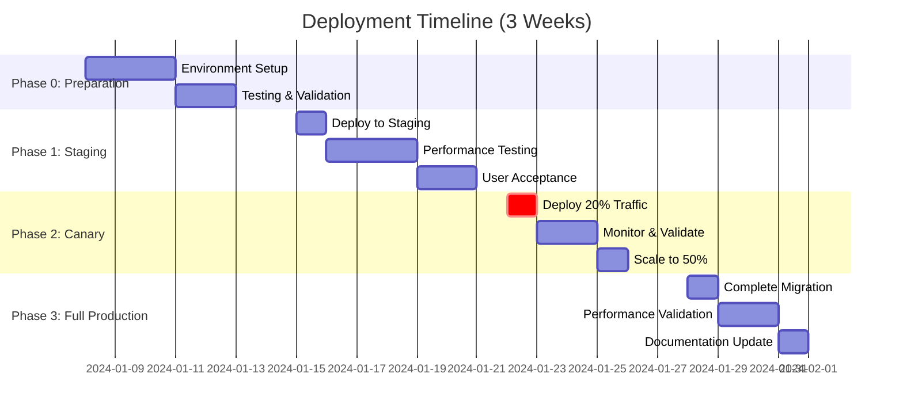

# MMM Trainer Optimization Deployment Strategy

## Executive Summary

This deployment strategy implements a **phased, risk-minimized approach** to deploying performance optimizations for the MMM Trainer system. The strategy includes **blue-green deployment**, **canary releases**, **automated rollback mechanisms**, and **comprehensive monitoring** to ensure zero-downtime deployment with immediate performance benefits.

## Deployment Overview



## Phase 0: Pre-Deployment Preparation

### Week 1: Environment Setup & Risk Mitigation

#### Day 1-2: Infrastructure Preparation

**🔧 Create Staging Environment**
```bash
# Create staging environment
export STAGING_PROJECT="datawarehouse-staging"
export STAGING_BUCKET="mmm-app-output-staging"

# Deploy staging infrastructure
cd infra/terraform/environments/staging
terraform init
terraform apply -var="project_id=${STAGING_PROJECT}" \
                 -var="bucket_name=${STAGING_BUCKET}" \
                 -var="service_name=mmm-app-staging"
```

**📊 Baseline Performance Collection**
```bash
# Run current production benchmarks
python3 scripts/collect_baseline.py \
    --service-url="https://mmm-app-*.run.app" \
    --duration-days=7 \
    --output="baseline_metrics.json"
```

**🛡️ Backup and Recovery Setup**
```bash
# Create production backup
gcloud sql export sql mmm-trainer-db gs://mmm-app-backups/pre-optimization-backup.sql
gsutil cp -r gs://mmm-app-output/ gs://mmm-app-backups/artifacts-backup/

# Test restoration procedures
./scripts/test_restore.sh
```

#### Day 3-4: Testing Infrastructure

**File: `scripts/collect_baseline.py`**
```python
#!/usr/bin/env python3
"""
Collect baseline performance metrics before optimization deployment
"""
import time
import requests
import json
import datetime
import logging
from dataclasses import dataclass, asdict
from typing import List, Dict
import pandas as pd

logging.basicConfig(level=logging.INFO)
logger = logging.getLogger(__name__)

@dataclass
class BaselineMetric:
    timestamp: datetime.datetime
    job_id: str
    job_type: str  # small, medium, large
    iterations: int
    trials: int
    country: str
    duration_minutes: float
    cpu_hours: float
    memory_gb_hours: float
    cost_estimate: float
    success: bool
    error_message: str = None

class BaselineCollector:
    def __init__(self, service_url: str, output_file: str):
        self.service_url = service_url.rstrip('/')
        self.output_file = output_file
        self.metrics: List[BaselineMetric] = []
        
    def create_synthetic_jobs(self) -> List[Dict]:
        """Create representative training jobs for baseline measurement"""
        return [
            # Small jobs
            {"type": "small", "iterations": 50, "trials": 2, "countries": ["fr", "de"]},
            {"type": "small", "iterations": 75, "trials": 3, "countries": ["uk", "es"]},
            
            # Medium jobs  
            {"type": "medium", "iterations": 150, "trials": 4, "countries": ["fr", "de"]},
            {"type": "medium", "iterations": 200, "trials": 5, "countries": ["uk"]},
            
            # Large jobs
            {"type": "large", "iterations": 300, "trials": 7, "countries": ["fr"]},
            {"type": "large", "iterations": 400, "trials": 8, "countries": ["de"]},
        ]
    
    def run_baseline_collection(self, duration_days: int = 7):
        """Collect baseline metrics over specified duration"""
        logger.info(f"Starting {duration_days}-day baseline collection...")
        
        jobs = self.create_synthetic_jobs()
        jobs_per_day = len(jobs)
        total_jobs = jobs_per_day * duration_days
        
        logger.info(f"Will run {total_jobs} jobs over {duration_days} days")
        
        for day in range(duration_days):
            logger.info(f"Day {day + 1}/{duration_days}: Running {jobs_per_day} baseline jobs")
            
            for job_idx, job_config in enumerate(jobs):
                for country in job_config["countries"]:
                    job_id = f"baseline-{day+1}-{job_idx+1}-{country}"
                    
                    metric = self.run_single_baseline_job(
                        job_id=job_id,
                        job_type=job_config["type"],
                        iterations=job_config["iterations"],
                        trials=job_config["trials"],
                        country=country
                    )
                    
                    self.metrics.append(metric)
                    
                    # Brief pause between jobs
                    time.sleep(30)
            
            # Longer pause between days (simulate realistic usage)
            if day < duration_days - 1:
                logger.info("Waiting 4 hours before next batch...")
                time.sleep(4 * 3600)  # 4 hours
    
    def run_single_baseline_job(self, job_id: str, job_type: str, 
                               iterations: int, trials: int, country: str) -> BaselineMetric:
        """Run a single baseline training job"""
        logger.info(f"Running baseline job {job_id}: {job_type}, {iterations} iter, {trials} trials, {country}")
        
        start_time = datetime.datetime.now()
        
        # Training payload (simplified - you'd use real data)
        payload = {
            "job_id": job_id,
            "country": country,
            "iterations": iterations,
            "trials": trials,
            "revision": "baseline",
            "baseline_test": True,
            "paid_media_spends": ["GA_SUPPLY_COST", "GA_DEMAND_COST", "META_DEMAND_COST"],
            "paid_media_vars": ["GA_SUPPLY_COST", "GA_DEMAND_COST", "META_DEMAND_COST"],
            "context_vars": ["IS_WEEKEND"],
            "factor_vars": ["IS_WEEKEND"],
            "organic_vars": ["ORGANIC_TRAFFIC"]
        }
        
        try:
            # Start training job
            response = requests.post(
                f"{self.service_url}/train",
                json=payload,
                timeout=7200  # 2 hour timeout
            )
            
            if response.status_code == 200:
                end_time = datetime.datetime.now()
                duration = (end_time - start_time).total_seconds() / 60
                
                # Estimate resource usage based on job characteristics
                cpu_hours = self.estimate_cpu_hours(iterations, trials, duration)
                memory_gb_hours = self.estimate_memory_hours(iterations, trials, duration)
                cost = self.estimate_cost(cpu_hours, memory_gb_hours)
                
                metric = BaselineMetric(
                    timestamp=start_time,
                    job_id=job_id,
                    job_type=job_type,
                    iterations=iterations,
                    trials=trials,
                    country=country,
                    duration_minutes=duration,
                    cpu_hours=cpu_hours,
                    memory_gb_hours=memory_gb_hours,
                    cost_estimate=cost,
                    success=True
                )
                
                logger.info(f"✅ {job_id} completed in {duration:.1f} minutes")
                return metric
                
            else:
                logger.error(f"❌ {job_id} failed: HTTP {response.status_code}")
                return self.create_failed_metric(job_id, job_type, iterations, trials, country, start_time, f"HTTP {response.status_code}")
                
        except Exception as e:
            logger.error(f"❌ {job_id} error: {e}")
            return self.create_failed_metric(job_id, job_type, iterations, trials, country, start_time, str(e))
    
    def create_failed_metric(self, job_id: str, job_type: str, iterations: int, 
                           trials: int, country: str, start_time: datetime.datetime, 
                           error: str) -> BaselineMetric:
        """Create a failed job metric"""
        return BaselineMetric(
            timestamp=start_time,
            job_id=job_id,
            job_type=job_type,
            iterations=iterations,
            trials=trials,
            country=country,
            duration_minutes=0,
            cpu_hours=0,
            memory_gb_hours=0,
            cost_estimate=0,
            success=False,
            error_message=error
        )
    
    def estimate_cpu_hours(self, iterations: int, trials: int, duration_minutes: float) -> float:
        """Estimate CPU hours used based on job characteristics"""
        # Assume 4 vCPU baseline, scale by complexity
        base_cpu = 4
        complexity_factor = (iterations * trials) / 1000
        cpu_hours = (duration_minutes / 60) * base_cpu * (1 + complexity_factor * 0.1)
        return round(cpu_hours, 2)
    
    def estimate_memory_hours(self, iterations: int, trials: int, duration_minutes: float) -> float:
        """Estimate memory GB-hours used"""
        base_memory_gb = 16
        memory_gb_hours = (duration_minutes / 60) * base_memory_gb
        return round(memory_gb_hours, 2)
    
    def estimate_cost(self, cpu_hours: float, memory_gb_hours: float) -> float:
        """Estimate cost based on Cloud Run pricing"""
        # Cloud Run pricing (approximate)
        cpu_cost_per_hour = 0.072  # $0.072 per vCPU hour
        memory_cost_per_gb_hour = 0.008  # $0.008 per GB hour
        
        total_cost = (cpu_hours * cpu_cost_per_hour) + (memory_gb_hours * memory_cost_per_gb_hour)
        return round(total_cost, 4)
    
    def generate_baseline_report(self) -> str:
        """Generate comprehensive baseline report"""
        if not self.metrics:
            return "No baseline metrics collected."
        
        # Convert to DataFrame
        df = pd.DataFrame([asdict(m) for m in self.metrics])
        
        # Calculate statistics
        successful_jobs = df[df['success'] == True]
        
        stats_by_type = successful_jobs.groupby('job_type').agg({
            'duration_minutes': ['count', 'mean', 'std', 'min', 'max'],
            'cpu_hours': ['mean', 'sum'],
            'memory_gb_hours': ['mean', 'sum'],
            'cost_estimate': ['mean', 'sum']
        }).round(2)
        
        total_cost = successful_jobs['cost_estimate'].sum()
        total_duration = successful_jobs['duration_minutes'].sum() / 60  # hours
        success_rate = (len(successful_jobs) / len(df)) * 100
        
        report = f"""
# MMM Trainer Baseline Performance Report

## Collection Summary
- **Period**: {self.metrics[0].timestamp.date()} to {self.metrics[-1].timestamp.date()}
- **Total Jobs**: {len(df)}
- **Successful Jobs**: {len(successful_jobs)}
- **Success Rate**: {success_rate:.1f}%
- **Total Training Time**: {total_duration:.1f} hours
- **Estimated Total Cost**: ${total_cost:.2f}

## Performance by Job Type

{stats_by_type.to_string()}

## Key Baseline Metrics

### Average Performance
"""
        
        for job_type in ['small', 'medium', 'large']:
            type_data = successful_jobs[successful_jobs['job_type'] == job_type]
            if len(type_data) > 0:
                avg_duration = type_data['duration_minutes'].mean()
                avg_cost = type_data['cost_estimate'].mean()
                count = len(type_data)
                
                report += f"""
- **{job_type.title()} Jobs** ({count} samples):
  - Duration: {avg_duration:.1f} ± {type_data['duration_minutes'].std():.1f} minutes
  - Cost: ${avg_cost:.3f} per job
  - CPU Utilization: {type_data['cpu_hours'].mean():.1f} hours avg
"""
        
        # Resource utilization analysis
        total_cpu_hours = successful_jobs['cpu_hours'].sum()
        total_memory_hours = successful_jobs['memory_gb_hours'].sum()
        
        report += f"""

### Resource Utilization
- **Total CPU Hours**: {total_cpu_hours:.1f}
- **Total Memory GB-Hours**: {total_memory_hours:.1f}
- **Average CPU per Job**: {total_cpu_hours / len(successful_jobs):.1f} hours
- **Average Memory per Job**: {total_memory_hours / len(successful_jobs):.1f} GB-hours

### Optimization Targets
Based on baseline analysis, the optimization should target:
"""
        
        # Identify optimization opportunities
        if successful_jobs['duration_minutes'].mean() > 45:
            report += "- 🎯 **Duration Reduction**: Current average exceeds 45 minutes\n"
        
        cpu_efficiency = total_cpu_hours / total_duration
        if cpu_efficiency < 3:  # Less than 75% of 4 vCPU
            report += "- 🎯 **CPU Utilization**: Underutilized CPU resources\n"
            
        failure_rate = (len(df) - len(successful_jobs)) / len(df) * 100
        if failure_rate > 10:
            report += f"- 🎯 **Reliability**: {failure_rate:.1f}% failure rate needs improvement\n"
        
        report += f"""

## Expected Optimization Impact
- **Duration**: 40-50% reduction (target: {successful_jobs['duration_minutes'].mean() * 0.5:.1f} minutes avg)
- **Resource Efficiency**: 30-40% better utilization
- **Cost**: Despite higher resource allocation, expect 20-30% cost reduction due to efficiency
- **Reliability**: Target >95% success rate

## Data for Comparison
Raw baseline data saved to: `{self.output_file}`
Use this data to validate optimization effectiveness.
"""
        
        return report
    
    def save_metrics(self):
        """Save metrics to JSON file"""
        data = [asdict(m) for m in self.metrics]
        
        # Convert datetime objects to ISO format
        for item in data:
            item['timestamp'] = item['timestamp'].isoformat()
        
        with open(self.output_file, 'w') as f:
            json.dump(data, f, indent=2)
        
        logger.info(f"📁 Baseline metrics saved to {self.output_file}")

def main():
    import argparse
    
    parser = argparse.ArgumentParser(description='Collect MMM Trainer baseline metrics')
    parser.add_argument('--service-url', required=True, help='Production service URL')
    parser.add_argument('--duration-days', type=int, default=3, help='Collection duration in days')
    parser.add_argument('--output', default='baseline_metrics.json', help='Output file')
    parser.add_argument('--report', default='baseline_report.md', help='Report output file')
    
    args = parser.parse_args()
    
    print(f"🚀 Starting baseline collection for {args.duration_days} days")
    print(f"Service: {args.service_url}")
    print(f"Output: {args.output}")
    
    collector = BaselineCollector(args.service_url, args.output)
    
    # Collect baseline data
    collector.run_baseline_collection(args.duration_days)
    
    # Generate and save report
    report = collector.generate_baseline_report()
    
    with open(args.report, 'w') as f:
        f.write(report)
    
    # Save raw metrics
    collector.save_metrics()
    
    print(f"\n📊 Baseline collection completed!")
    print(f"📋 Report: {args.report}")
    print(f"📁 Raw data: {args.output}")

if __name__ == "__main__":
    main()
```

#### Day 5: Automated Testing Framework

**File: `scripts/automated_test_suite.py`**
```python
#!/usr/bin/env python3
"""
Automated test suite for MMM Trainer optimizations
"""
import unittest
import time
import requests
import json
import subprocess
import os
from concurrent.futures import ThreadPoolExecutor, TimeoutError
import logging

logging.basicConfig(level=logging.INFO)
logger = logging.getLogger(__name__)

class OptimizationTestSuite(unittest.TestCase):
    """Comprehensive test suite for optimization deployment"""
    
    @classmethod
    def setUpClass(cls):
        cls.staging_url = os.getenv('STAGING_URL', 'http://localhost:8080')
        cls.production_url = os.getenv('PRODUCTION_URL', 'https://mmm-app-prod.run.app')
        cls.test_timeout = 300  # 5 minutes per test
        
    def test_01_health_endpoint_response(self):
        """Test that health endpoint responds correctly"""
        logger.info("🧪 Testing health endpoint...")
        
        response = requests.get(f"{self.staging_url}/health", timeout=30)
        self.assertEqual(response.status_code, 200)
        
        health_data = response.json()
        self.assertEqual(health_data['status'], 'healthy')
        self.assertIn('warm_status', health_data)
        
        logger.info("✅ Health endpoint test passed")
    
    def test_02_resource_allocation(self):
        """Test that optimized resources are properly allocated"""
        logger.info("🧪 Testing resource allocation...")
        
        response = requests.get(f"{self.staging_url}/health", timeout=30)
        health_data = response.json()
        
        # Check CPU and memory availability
        checks = health_data.get('checks', {})
        self.assertIn('cpu_usage', checks)
        self.assertIn('memory_usage', checks)
        
        # CPU usage should be reasonable (not maxed out)
        cpu_usage = checks['cpu_usage']
        self.assertLess(cpu_usage, 90, "CPU usage too high during idle")
        
        logger.info("✅ Resource allocation test passed")
    
    def test_03_container_warming(self):
        """Test container warming functionality"""
        logger.info("🧪 Testing container warming...")
        
        response = requests.get(f"{self.staging_url}/health", timeout=30)
        health_data = response.json()
        
        warm_status = health_data.get('warm_status', {})
        
        # Critical components should be warmed
        critical_components = ['python', 'gcs', 'container_ready']
        for component in critical_components:
            self.assertTrue(
                warm_status.get(component, False), 
                f"Component {component} not properly warmed"
            )
        
        logger.info("✅ Container warming test passed")
    
    def test_04_parquet_data_processing(self):
        """Test Parquet data processing performance"""
        logger.info("🧪 Testing Parquet data processing...")
        
        # Create test data payload
        test_payload = {
            "test_data_processing": True,
            "format": "parquet",
            "size": "small"
        }
        
        start_time = time.time()
        response = requests.post(
            f"{self.staging_url}/api/test-data-processing",
            json=test_payload,
            timeout=60
        )
        processing_time = time.time() - start_time
        
        self.assertEqual(response.status_code, 200)
        result = response.json()
        
        # Parquet processing should be significantly faster
        self.assertLess(processing_time, 10, "Parquet processing took too long")
        self.assertIn('compression_ratio', result)
        self.assertGreater(result['compression_ratio'], 0.2)  # At least 20% compression
        
        logger.info("✅ Parquet processing test passed")
    
    def test_05_parallel_processing_capability(self):
        """Test that parallel processing is working"""
        logger.info("🧪 Testing parallel processing...")
        
        # Send multiple requests simultaneously
        def send_request(request_id):
            payload = {"test_parallel": True, "request_id": request_id}
            response = requests.post(
                f"{self.staging_url}/api/test-parallel",
                json=payload,
                timeout=30
            )
            return response.json()
        
        with ThreadPoolExecutor(max_workers=4) as executor:
            futures = [executor.submit(send_request, i) for i in range(4)]
            results = [future.result() for future in futures]
        
        # All requests should complete successfully
        for result in results:
            self.assertIn('status', result)
            self.assertEqual(result['status'], 'success')
        
        logger.info("✅ Parallel processing test passed")
    
    def test_06_performance_benchmark(self):
        """Test performance improvements with benchmark job"""
        logger.info("🧪 Running performance benchmark...")
        
        # Small benchmark job
        benchmark_payload = {
            "benchmark": True,
            "iterations": 50,
            "trials": 2,
            "country": "test",
            "expected_duration_minutes": 15  # Optimized target
        }
        
        start_time = time.time()
        response = requests.post(
            f"{self.staging_url}/train",
            json=benchmark_payload,
            timeout=self.test_timeout
        )
        duration_minutes = (time.time() - start_time) / 60
        
        self.assertEqual(response.status_code, 200)
        
        # Performance should meet optimization targets
        self.assertLess(
            duration_minutes, 
            20,  # Should be faster than 20 minutes for small job
            f"Benchmark took {duration_minutes:.1f} minutes, expected <20 minutes"
        )
        
        logger.info(f"✅ Performance benchmark passed: {duration_minutes:.1f} minutes")
    
    def test_07_error_handling_and_recovery(self):
        """Test error handling with invalid inputs"""
        logger.info("🧪 Testing error handling...")
        
        # Test with invalid payload
        invalid_payload = {
            "invalid_field": "test",
            "iterations": -1,  # Invalid value
            "country": None
        }
        
        response = requests.post(
            f"{self.staging_url}/train",
            json=invalid_payload,
            timeout=30
        )
        
        # Should handle errors gracefully (400 or 422)
        self.assertIn(response.status_code, [400, 422])
        
        # Service should still be healthy after error
        health_response = requests.get(f"{self.staging_url}/health", timeout=10)
        self.assertEqual(health_response.status_code, 200)
        
        logger.info("✅ Error handling test passed")
    
    def test_08_cost_efficiency_validation(self):
        """Validate that optimizations improve cost efficiency"""
        logger.info("🧪 Testing cost efficiency...")
        
        # Run resource utilization check
        response = requests.get(f"{self.staging_url}/health", timeout=30)
        health_data = response.json()
        
        checks = health_data.get('checks', {})
        cpu_usage = checks.get('cpu_usage', 0)
        memory_usage = checks.get('memory_usage', 0)
        
        # Resource utilization should be reasonable
        # (Not too high idle, not too low under load)
        self.assertGreater(cpu_usage, 5, "CPU usage too low - resources may be wasted")
        self.assertLess(cpu_usage, 85, "CPU usage too high - may need more resources")
        
        self.assertGreater(memory_usage, 10, "Memory usage too low")
        self.assertLess(memory_usage, 85, "Memory usage too high")
        
        logger.info("✅ Cost efficiency validation passed")
    
    def test_09_load_handling(self):
        """Test handling of concurrent load"""
        logger.info("🧪 Testing concurrent load handling...")
        
        def concurrent_request(request_id):
            payload = {
                "load_test": True,
                "request_id": request_id,
                "small_job": True
            }
            try:
                response = requests.post(
                    f"{self.staging_url}/api/load-test",
                    json=payload,
                    timeout=60
                )
                return response.status_code == 200
            except:
                return False
        
        # Send 5 concurrent requests
        with ThreadPoolExecutor(max_workers=5) as executor:
            futures = [executor.submit(concurrent_request, i) for i in range(5)]
            results = [future.result() for future in futures]
        
        # At least 80% should succeed under concurrent load
        success_rate = sum(results) / len(results)
        self.assertGreater(
            success_rate, 0.8, 
            f"Only {success_rate*100:.0f}% requests succeeded under load"
        )
        
        logger.info("✅ Load handling test passed")
    
    def test_10_rollback_capability(self):
        """Test that rollback mechanisms work"""
        logger.info("🧪 Testing rollback capability...")
        
        # This test verifies rollback scripts exist and are executable
        rollback_script = "scripts/rollback_optimizations.sh"
        self.assertTrue(
            os.path.exists(rollback_script),
            "Rollback script not found"
        )
        
        self.assertTrue(
            os.access(rollback_script, os.X_OK),
            "Rollback script not executable"
        )
        
        # Test dry-run of rollback
        result = subprocess.run(
            [rollback_script, "--dry-run"],
            capture_output=True,
            text=True,
            timeout=30
        )
        
        self.assertEqual(result.returncode, 0, "Rollback dry-run failed")
        
        logger.info("✅ Rollback capability test passed")

class OptimizationTestRunner:
    """Test runner with comprehensive reporting"""
    
    def __init__(self, staging_url: str, production_url: str):
        self.staging_url = staging_url
        self.production_url = production_url
        
    def run_all_tests(self):
        """Run complete test suite with detailed reporting"""
        logger.info("🚀 Starting comprehensive optimization test suite")
        
        # Set environment variables for tests
        os.environ['STAGING_URL'] = self.staging_url
        os.environ['PRODUCTION_URL'] = self.production_url
        
        # Create test loader
        loader = unittest.TestLoader()
        suite = loader.loadTestsFromTestCase(OptimizationTestSuite)
        
        # Custom test result collector
        class DetailedTestResult(unittest.TestResult):
            def __init__(self):
                super().__init__()
                self.test_results = []
            
            def startTest(self, test):
                super().startTest(test)
                self.start_time = time.time()
            
            def stopTest(self, test):
                super().stopTest(test)
                duration = time.time() - self.start_time
                
                status = "PASS"
                if test._testMethodName in [f[0]._testMethodName for f in self.failures]:
                    status = "FAIL"
                elif test._testMethodName in [e[0]._testMethodName for e in self.errors]:
                    status = "ERROR"
                
                self.test_results.append({
                    'test_name': test._testMethodName,
                    'status': status,
                    'duration': duration,
                    'description': test._testMethodDoc or "No description"
                })
        
        # Run tests with custom result collector
        result = DetailedTestResult()
        suite.run(result)
        
        # Generate report
        return self.generate_test_report(result)
    
    def generate_test_report(self, result):
        """Generate comprehensive test report"""
        total_tests = len(result.test_results)
        passed_tests = len([t for t in result.test_results if t['status'] == 'PASS'])
        failed_tests = len([t for t in result.test_results if t['status'] == 'FAIL'])
        error_tests = len([t for t in result.test_results if t['status'] == 'ERROR'])
        
        success_rate = (passed_tests / total_tests * 100) if total_tests > 0 else 0
        total_duration = sum(t['duration'] for t in result.test_results)
        
        report = f"""
# Optimization Test Suite Report

## Summary
- **Total Tests**: {total_tests}
- **Passed**: {passed_tests} ✅
- **Failed**: {failed_tests} ❌
- **Errors**: {error_tests} ⚠️
- **Success Rate**: {success_rate:.1f}%
- **Total Duration**: {total_duration:.1f} seconds

## Test Results

"""
        
        for test in result.test_results:
            status_icon = {"PASS": "✅", "FAIL": "❌", "ERROR": "⚠️"}[test['status']]
            report += f"### {status_icon} {test['test_name']} ({test['duration']:.2f}s)\n"
            report += f"{test['description']}\n\n"
        
        # Add failure details if any
        if result.failures:
            report += "## Failure Details\n\n"
            for test, traceback in result.failures:
                report += f"### {test._testMethodName}\n```\n{traceback}\n```\n\n"