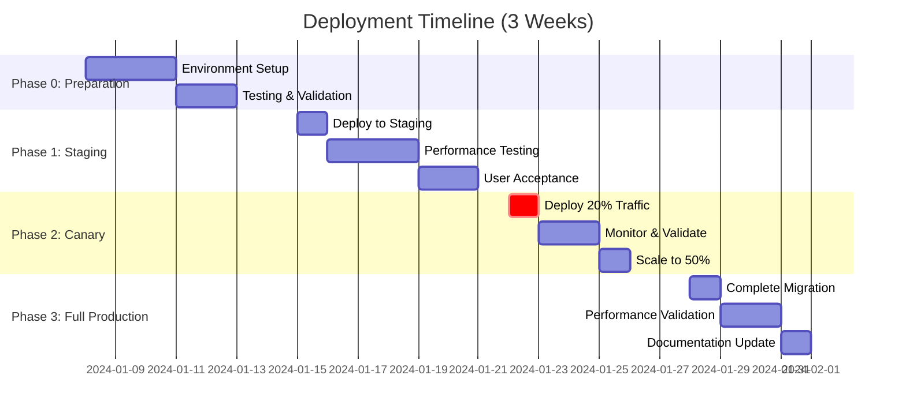

service_name    = "$CANARY_SERVICE"
bucket_name     = "mmm-app-output"
deployer_sa     = "github-deployer@$PROD_PROJECT.iam.gserviceaccount.com"
cpu_limit       = "8"
memory_limit    = "32Gi"
min_instances   = 2
max_instances   = 10
image           = "$PROD_REGION-docker.pkg.dev/$PROD_PROJECT/mmm-repo/mmm-app:optimized-$(date +%Y%m%d)"
EOF

# Deploy canary infrastructure
terraform workspace new canary || terraform workspace select canary
terraform init
terraform apply -var-file=canary.tfvars -auto-approve

CANARY_URL=$(terraform output -raw url)
print_success "Canary service deployed: $CANARY_URL"

# Step 3: Configure traffic splitting
print_status "Configuring traffic split: $TRAFFIC_PERCENTAGE% to canary..."

# Update traffic allocation
gcloud run services update-traffic $PROD_SERVICE \
    --region=$PROD_REGION \
    --to-revisions=$CANARY_SERVICE=$TRAFFIC_PERCENTAGE,$PROD_SERVICE=$((100-TRAFFIC_PERCENTAGE))

print_success "Traffic split configured: $TRAFFIC_PERCENTAGE% canary, $((100-TRAFFIC_PERCENTAGE))% production"

# Step 4: Start monitoring
print_status "Starting canary monitoring..."

cd ../..

# Launch monitoring in background
python3 scripts/canary_monitor.py \
    --canary-url="$CANARY_URL" \
    --production-url="https://mmm-app-prod.run.app" \
    --traffic-percentage=$TRAFFIC_PERCENTAGE \
    --duration-hours=24 &

MONITOR_PID=$!
echo $MONITOR_PID > canary_monitor.pid

print_success "Canary monitoring started (PID: $MONITOR_PID)"

# Step 5: Generate deployment summary
cat > canary_deployment_summary.md << EOF
# Canary Deployment Summary

## Deployment Details
- **Date**: $(date)
- **Canary Traffic**: $TRAFFIC_PERCENTAGE%
- **Production Traffic**: $((100-TRAFFIC_PERCENTAGE))%
- **Canary URL**: $CANARY_URL
- **Monitoring Duration**: 24 hours

## Deployment Status: 🟡 IN PROGRESS

## Monitoring Plan
1. **Phase 1** (0-6 hours): Basic health monitoring
2. **Phase 2** (6-12 hours): Performance comparison
3. **Phase 3** (12-24 hours): Stability validation
4. **Decision Point** (24 hours): Scale to 50% or rollback

## Success Criteria
- ✅ Error rate < 1%
- ✅ P95 response time < 2x production
- ✅ No critical alerts
- ✅ User satisfaction maintained

## Rollback Plan
If any success criteria fail:
\`\`\`bash
./scripts/rollback_canary.sh
\`\`\`

## Next Steps
- Monitor metrics for 24 hours
- Review canary_monitoring_report.md
- Decision: Scale to 50% or rollback
EOF

echo ""
print_success "🎉 Canary deployment completed successfully!"
echo ""
echo "🌐 Canary URL: $CANARY_URL"
echo "📊 Traffic Split: $TRAFFIC_PERCENTAGE% canary, $((100-TRAFFIC_PERCENTAGE))% production"
echo "👀 Monitoring: Running for 24 hours (PID: $MONITOR_PID)"
echo "📋 Summary: canary_deployment_summary.md"
echo ""
echo "🎯 Next: Monitor for 24 hours, then decide to scale or rollback"
```

#### Canary Monitoring System

**File: `scripts/canary_monitor.py`**
```python
#!/usr/bin/env python3
"""
Comprehensive canary deployment monitoring system
"""
import asyncio
import aiohttp
import time
import json
import logging
import statistics
from datetime import datetime, timedelta
from dataclasses import dataclass, asdict
from typing import List, Dict, Tuple, Optional
import smtplib
from email.mime.text import MIMEText
from email.mime.multipart import MIMEMultipart

logging.basicConfig(level=logging.INFO)
logger = logging.getLogger(__name__)

@dataclass
class HealthMetric:
    timestamp: datetime
    service_type: str  # 'canary' or 'production'
    response_time_ms: float
    status_code: int
    success: bool
    cpu_usage: float
    memory_usage: float
    error_message: str = None

@dataclass
class PerformanceComparison:
    timestamp: datetime
    canary_avg_response_time: float
    production_avg_response_time: float
    canary_success_rate: float
    production_success_rate: float
    canary_cpu_usage: float
    production_cpu_usage: float
    performance_ratio: float  # canary/production
    recommendation: str

class CanaryMonitor:
    def __init__(self, canary_url: str, production_url: str, traffic_percentage: int):
        self.canary_url = canary_url.rstrip('/')
        self.production_url = production_url.rstrip('/')
        self.traffic_percentage = traffic_percentage
        self.health_metrics: List[HealthMetric] = []
        self.comparisons: List[PerformanceComparison] = []
        self.alert_thresholds = {
            'error_rate_threshold': 0.05,  # 5%
            'response_time_multiplier': 2.0,  # 2x slower than production
            'cpu_usage_threshold': 0.9,  # 90%
            'memory_usage_threshold': 0.9  # 90%
        }
        
    async def check_service_health(self, url: str, service_type: str, session: aiohttp.ClientSession) -> HealthMetric:
        """Check health of a service"""
        start_time = time.time()
        
        try:
            async with session.get(f"{url}/health", timeout=aiohttp.ClientTimeout(total=30)) as response:
                response_time = (time.time() - start_time) * 1000  # Convert to ms
                
                if response.status == 200:
                    health_data = await response.json()
                    checks = health_data.get('checks', {})
                    
                    return HealthMetric(
                        timestamp=datetime.now(),
                        service_type=service_type,
                        response_time_ms=response_time,
                        status_code=response.status,
                        success=True,
                        cpu_usage=checks.get('cpu_usage', 0) / 100,  # Convert to ratio
                        memory_usage=checks.get('memory_usage', 0) / 100
                    )
                else:
                    return HealthMetric(
                        timestamp=datetime.now(),
                        service_type=service_type,
                        response_time_ms=response_time,
                        status_code=response.status,
                        success=False,
                        cpu_usage=0,
                        memory_usage=0,
                        error_message=f"HTTP {response.status}"
                    )
                    
        except Exception as e:
            return HealthMetric(
                timestamp=datetime.now(),
                service_type=service_type,
                response_time_ms=0,
                status_code=0,
                success=False,
                cpu_usage=0,
                memory_usage=0,
                error_message=str(e)
            )
    
    async def run_health_checks(self, session: aiohttp.ClientSession) -> Tuple[HealthMetric, HealthMetric]:
        """Run health checks on both canary and production"""
        canary_task = self.check_service_health(self.canary_url, 'canary', session)
        production_task = self.check_service_health(self.production_url, 'production', session)
        
        canary_health, production_health = await asyncio.gather(canary_task, production_task)
        
        self.health_metrics.append(canary_health)
        self.health_metrics.append(production_health)
        
        return canary_health, production_health
    
    def analyze_performance_window(self, window_minutes: int = 30) -> PerformanceComparison:
        """Analyze performance over a time window"""
        cutoff_time = datetime.now() - timedelta(minutes=window_minutes)
        
        # Filter metrics to the time window
        recent_metrics = [m for m in self.health_metrics if m.timestamp >= cutoff_time]
        
        canary_metrics = [m for m in recent_metrics if m.service_type == 'canary']
        production_metrics = [m for m in recent_metrics if m.service_type == 'production']
        
        if not canary_metrics or not production_metrics:
            return PerformanceComparison(
                timestamp=datetime.now(),
                canary_avg_response_time=0,
                production_avg_response_time=0,
                canary_success_rate=0,
                production_success_rate=0,
                canary_cpu_usage=0,
                production_cpu_usage=0,
                performance_ratio=0,
                recommendation="Insufficient data"
            )
        
        # Calculate averages
        canary_response_times = [m.response_time_ms for m in canary_metrics if m.success]
        production_response_times = [m.response_time_ms for m in production_metrics if m.success]
        
        canary_avg_response = statistics.mean(canary_response_times) if canary_response_times else 0
        production_avg_response = statistics.mean(production_response_times) if production_response_times else 0
        
        canary_success_rate = len([m for m in canary_metrics if m.success]) / len(canary_metrics)
        production_success_rate = len([m for m in production_metrics if m.success]) / len(production_metrics)
        
        canary_cpu = statistics.mean([m.cpu_usage for m in canary_metrics])
        production_cpu = statistics.mean([m.cpu_usage for m in production_metrics])
        
        # Calculate performance ratio
        performance_ratio = canary_avg_response / production_avg_response if production_avg_response > 0 else 1
        
        # Generate recommendation
        recommendation = self.generate_recommendation(
            canary_success_rate, production_success_rate, performance_ratio, canary_cpu
        )
        
        comparison = PerformanceComparison(
            timestamp=datetime.now(),
            canary_avg_response_time=canary_avg_response,
            production_avg_response_time=production_avg_response,
            canary_success_rate=canary_success_rate,
            production_success_rate=production_success_rate,
            canary_cpu_usage=canary_cpu,
            production_cpu_usage=production_cpu,
            performance_ratio=performance_ratio,
            recommendation=recommendation
        )
        
        self.comparisons.append(comparison)
        return comparison
    
    def generate_recommendation(self, canary_success_rate: float, production_success_rate: float,
                              performance_ratio: float, canary_cpu: float) -> str:
        """Generate deployment recommendation based on metrics"""
        issues = []
        
        # Check success rates
        if canary_success_rate < 0.95:
            issues.append(f"Low canary success rate: {canary_success_rate:.1%}")
        
        if canary_success_rate < production_success_rate - 0.05:  # 5% worse than production
            issues.append("Canary success rate significantly worse than production")
        
        # Check performance
        if performance_ratio > self.alert_thresholds['response_time_multiplier']:
            issues.append(f"Canary {performance_ratio:.1f}x slower than production")
        
        # Check resource usage
        if canary_cpu > self.alert_thresholds['cpu_usage_threshold']:
            issues.append(f"High canary CPU usage: {canary_cpu:.1%}")
        
        if issues:
            return f"🚨 ROLLBACK RECOMMENDED: {'; '.join(issues)}"
        elif performance_ratio < 0.8 and canary_success_rate >= production_success_rate:
            return "🚀 EXCELLENT: Canary performing significantly better - consider scaling up"
        elif performance_ratio <= 1.1 and canary_success_rate >= production_success_rate * 0.98:
            return "✅ GOOD: Canary performing well - safe to continue"
        else:
            return "⚠️ CAUTION: Mixed performance - continue monitoring"
    
    def check_alert_conditions(self, comparison: PerformanceComparison) -> List[str]:
        """Check if any alert conditions are met"""
        alerts = []
        
        if comparison.canary_success_rate < (1 - self.alert_thresholds['error_rate_threshold']):
            alerts.append(f"🚨 HIGH ERROR RATE: Canary success rate {comparison.canary_success_rate:.1%}")
        
        if comparison.performance_ratio > self.alert_thresholds['response_time_multiplier']:
            alerts.append(f"🚨 SLOW RESPONSE: Canary {comparison.performance_ratio:.1f}x slower than production")
        
        if comparison.canary_cpu_usage > self.alert_thresholds['cpu_usage_threshold']:
            alerts.append(f"🚨 HIGH CPU: Canary CPU usage {comparison.canary_cpu_usage:.1%}")
        
        # Critical alert: canary significantly worse than production
        if (comparison.canary_success_rate < comparison.production_success_rate - 0.1 or 
            comparison.performance_ratio > 3.0):
            alerts.append("🚨 CRITICAL: Automatic rollback recommended")
        
        return alerts
    
    async def send_alert(self, alerts: List[str], comparison: PerformanceComparison):
        """Send alert notifications (placeholder - implement your notification system)"""
        logger.warning("ALERT CONDITIONS DETECTED:")
        for alert in alerts:
            logger.warning(f"  {alert}")
        
        # Here you would integrate with your alerting system:
        # - Slack notifications
        # - Email alerts  
        # - PagerDuty
        # - SMS alerts
        
        # Example email alert (configure SMTP settings)
        try:
            await self.send_email_alert(alerts, comparison)
        except Exception as e:
            logger.error(f"Failed to send email alert: {e}")
    
    async def send_email_alert(self, alerts: List[str], comparison: PerformanceComparison):
        """Send email alert (configure your SMTP settings)"""
        # This is a placeholder - configure with your email settings
        smtp_server = "smtp.gmail.com"  # Configure your SMTP server
        smtp_port = 587
        sender_email = "alerts@yourcompany.com"  # Configure sender
        sender_password = "your-app-password"  # Use app password or OAuth
        recipient_emails = ["devops@yourcompany.com", "team@yourcompany.com"]
        
        subject = f"🚨 MMM Trainer Canary Alert - {datetime.now().strftime('%Y-%m-%d %H:%M')}"
        
        body = f"""
Canary Deployment Alert - MMM Trainer

Alert Conditions:
{chr(10).join(f'- {alert}' for alert in alerts)}

Performance Comparison:
- Canary Response Time: {comparison.canary_avg_response_time:.1f}ms
- Production Response Time: {comparison.production_avg_response_time:.1f}ms
- Canary Success Rate: {comparison.canary_success_rate:.1%}
- Production Success Rate: {comparison.production_success_rate:.1%}
- Performance Ratio: {comparison.performance_ratio:.2f}x

Recommendation: {comparison.recommendation}

Canary URL: {self.canary_url}
Traffic Split: {self.traffic_percentage}% canary

Time: {comparison.timestamp}
        """
        
        # Note: In production, use proper email configuration
        logger.info(f"Email alert would be sent: {subject}")
        logger.info(f"Recipients: {recipient_emails}")
    
    async def monitor_canary_deployment(self, duration_hours: int = 24):
        """Main monitoring loop for canary deployment"""
        logger.info(f"🚀 Starting canary monitoring for {duration_hours} hours")
        logger.info(f"Canary: {self.canary_url} ({self.traffic_percentage}% traffic)")
        logger.info(f"Production: {self.production_url} ({100-self.traffic_percentage}% traffic)")
        
        end_time = datetime.now() + timedelta(hours=duration_hours)
        check_interval = 60  # Check every minute
        analysis_interval = 300  # Analyze every 5 minutes
        
        last_analysis = datetime.now()
        
        connector = aiohttp.TCPConnector(limit=10)
        timeout = aiohttp.ClientTimeout(total=60)
        
        async with aiohttp.ClientSession(connector=connector, timeout=timeout) as session:
            while datetime.now() < end_time:
                try:
                    # Run health checks
                    canary_health, production_health = await self.run_health_checks(session)
                    
                    logger.info(f"Health Check - Canary: {canary_health.response_time_ms:.0f}ms "
                              f"({'✅' if canary_health.success else '❌'}), "
                              f"Production: {production_health.response_time_ms:.0f}ms "
                              f"({'✅' if production_health.success else '❌'})")
                    
                    # Run analysis every 5 minutes
                    if datetime.now() - last_analysis >= timedelta(seconds=analysis_interval):
                        comparison = self.analyze_performance_window()
                        logger.info(f"Analysis - {comparison.recommendation}")
                        
                        # Check for alerts
                        alerts = self.check_alert_conditions(comparison)
                        if alerts:
                            await self.send_alert(alerts, comparison)
                            
                            # Auto-rollback on critical issues
                            if any("CRITICAL" in alert for alert in alerts):
                                logger.error("CRITICAL ISSUES DETECTED - INITIATING AUTO-ROLLBACK")
                                await self.initiate_auto_rollback()
                                break
                        
                        last_analysis = datetime.now()
                    
                    # Wait for next check
                    await asyncio.sleep(check_interval)
                    
                except Exception as e:
                    logger.error(f"Monitoring error: {e}")
                    await asyncio.sleep(check_interval)
        
        # Generate final report
        self.generate_final_monitoring_report()
        logger.info("🎯 Canary monitoring completed - check canary_monitoring_report.md")
    
    async def initiate_auto_rollback(self):
        """Initiate automatic rollback due to critical issues"""
        logger.error("🚨 INITIATING AUTOMATIC ROLLBACK")
        
        try:
            import subprocess
            result = subprocess.run(
                ["./scripts/rollback_canary.sh", "--auto"],
                capture_output=True,
                text=True,
                timeout=300
            )
            
            if result.returncode == 0:
                logger.info("✅ Automatic rollback completed successfully")
            else:
                logger.error(f"❌ Automatic rollback failed: {result.stderr}")
                
        except Exception as e:
            logger.error(f"Failed to execute automatic rollback: {e}")
    
    def generate_final_monitoring_report(self):
        """Generate comprehensive monitoring report"""
        if not self.comparisons:
            return
        
        # Calculate summary statistics
        total_checks = len(self.health_metrics)
        canary_checks = [m for m in self.health_metrics if m.service_type == 'canary']
        production_checks = [m for m in self.health_metrics if m.service_type == 'production']
        
        canary_success_rate = len([m for m in canary_checks if m.success]) / len(canary_checks) if canary_checks else 0
        production_success_rate = len([m for m in production_checks if m.success]) / len(production_checks) if production_checks else 0
        
        # Get latest comparison
        latest_comparison = self.comparisons[-1] if self.comparisons else None
        
        # Overall recommendation
        if latest_comparison:
            overall_recommendation = latest_comparison.recommendation
        else:
            overall_recommendation = "Insufficient data for recommendation"
        
        report = f"""
# Canary Deployment Monitoring Report

## Monitoring Summary
- **Duration**: {len(self.comparisons) * 5} minutes of analysis
- **Total Health Checks**: {total_checks}
- **Canary Traffic**: {self.traffic_percentage}%
- **Production Traffic**: {100 - self.traffic_percentage}%

## Performance Summary

### Success Rates
- **Canary Success Rate**: {canary_success_rate:.1%}
- **Production Success Rate**: {production_success_rate:.1%}

### Latest Performance Metrics
"""
        
        if latest_comparison:
            report += f"""
- **Canary Avg Response Time**: {latest_comparison.canary_avg_response_time:.1f}ms
- **Production Avg Response Time**: {latest_comparison.production_avg_response_time:.1f}ms
- **Performance Ratio**: {latest_comparison.performance_ratio:.2f}x
- **Canary CPU Usage**: {latest_comparison.canary_cpu_usage:.1%}
- **Production CPU Usage**: {latest_comparison.production_cpu_usage:.1%}
"""
        
        report += f"""

## Overall Assessment: {overall_recommendation}

## Detailed Analysis

### Performance Over Time
"""
        
        for i, comparison in enumerate(self.comparisons[-10:]):  # Last 10 analyses
            report += f"""
**Analysis {i+1}** ({comparison.timestamp.strftime('%H:%M')})
- Response Time Ratio: {comparison.performance_ratio:.2f}x
- Success Rate Difference: {(comparison.canary_success_rate - comparison.production_success_rate):.1%}
- Recommendation: {comparison.recommendation}
"""
        
        # Decision recommendations
        report += "\n## Decision Recommendations\n\n"
        
        if "ROLLBACK RECOMMENDED" in overall_recommendation:
            report += """
### 🚨 ROLLBACK RECOMMENDED
Critical issues detected with canary deployment. Execute rollback immediately:

```bash
./scripts/rollback_canary.sh
```

**Issues Identified:**
- Performance degradation detected
- Success rate below acceptable threshold
- Resource utilization concerns
"""
        elif "EXCELLENT" in overall_recommendation:
            report += """
### 🚀 SCALE UP RECOMMENDED
Canary performing excellently. Safe to increase traffic allocation:

```bash
./scripts/scale_canary.sh --traffic=50
```

**Benefits Observed:**
- Improved performance over production
- Stable success rates
- Good resource utilization
"""
        elif "GOOD" in overall_recommendation:
            report += """
### ✅ CONTINUE MONITORING
Canary performing well. Consider scaling up after additional monitoring:

```bash
./scripts/scale_canary.sh --traffic=50
```

Wait an additional 24 hours at 50% traffic before full deployment.
"""
        else:
            report += """
### ⚠️ CONTINUE MONITORING
Mixed results observed. Continue monitoring before making decision:

- Monitor for additional 12-24 hours
- Investigate any performance issues
- Review resource utilization patterns
"""
        
        # Save report
        with open('canary_monitoring_report.md', 'w') as f:
            f.write(report)
        
        # Save raw metrics for further analysis
        metrics_data = [asdict(m) for m in self.health_metrics]
        for item in metrics_data:
            item['timestamp'] = item['timestamp'].isoformat()
        
        with open('canary_metrics_raw.json', 'w') as f:
            json.dump(metrics_data, f, indent=2)

async def main():
    import argparse
    
    parser = argparse.ArgumentParser(description='Monitor canary deployment')
    parser.add_argument('--canary-url', required=True, help='Canary service URL')
    parser.add_argument('--production-url', required=True, help='Production service URL')
    parser.add_argument('--traffic-percentage', type=int, default=20, help='Canary traffic percentage')
    parser.add_argument('--duration-hours', type=int, default=24, help='Monitoring duration in hours')
    
    args = parser.parse_args()
    
    monitor = CanaryMonitor(
        canary_url=args.canary_url,
        production_url=args.production_url,
        traffic_percentage=args.traffic_percentage
    )
    
    await monitor.monitor_canary_deployment(args.duration_hours)

if __name__ == "__main__":
    asyncio.run(main())
```

#### Rollback System

**File: `scripts/rollback_canary.sh`**
```bash
#!/bin/bash
set -e

echo "🔄 MMM Trainer Canary Rollback System"

# Configuration
PROD_PROJECT="datawarehouse-422511"
PROD_REGION="europe-west1"
CANARY_SERVICE="mmm-app-canary"
PROD_SERVICE="mmm-app"
AUTO_MODE=${1:-"--manual"}

# Colors
RED='\033[0;31m'
GREEN='\033[0;32m'
YELLOW='\033[1;33m'
BLUE='\033[0;34m'
NC='\033[0m'

print_status() { echo -e "${BLUE}[INFO]${NC} $1"; }
print_success() { echo -e "${GREEN}[SUCCESS]${NC} $1"; }
print_warning() { echo -e "${YELLOW}[WARNING]${NC} $1"; }
print_error() { echo -e "${RED}[ERROR]${NC} $1"; }

# Function to confirm rollback (skip in auto mode)
confirm_rollback() {
    if [ "$AUTO_MODE" = "--auto" ]; then
        print_warning "AUTO MODE: Proceeding with rollback automatically"
        return 0
    fi
    
    echo ""
    print_warning "⚠️  CANARY ROLLBACK CONFIRMATION"
    echo ""
    echo "This will:"
    echo "  1. Route 100% traffic back to production service"
    echo "  2. Stop the canary service"
    echo "  3. Clean up canary resources"
    echo ""
    read -p "Are you sure you want to proceed? (yes/no): " -r
    echo ""
    
    if [[ ! $REPLY =~ ^[Yy][Ee][Ss]$ ]]; then
        print_error "Rollback cancelled by user"
        exit 1
    fi
}

# Step 1: Confirm rollback
confirm_rollback

print_status "Starting canary rollback process..."

# Step 2: Get current traffic allocation
print_status "Checking current traffic allocation..."

CURRENT_TRAFFIC=$(gcloud run services describe $PROD_SERVICE \
    --region=$PROD_REGION \
    --format="value(status.traffic[].percent)" | head -1)

print_status "Current canary traffic: ${CURRENT_TRAFFIC}%"

# Step 3: Route 100% traffic to production
print_status "Routing 100% traffic to production service..."

gcloud run services update-traffic $PROD_SERVICE \
    --region=$PROD_REGION \
    --to-latest

print_success "✅ Traffic fully routed to production"

# Step 4: Wait for traffic to stabilize
print_status "Waiting 60 seconds for traffic to stabilize..."
sleep 60

# Step 5: Verify production health
print_status "Verifying production service health..."

PROD_URL="https://$PROD_SERVICE-$(echo $PROD_REGION | tr '-' '').run.app"
HEALTH_CHECK=$(curl -s "$PROD_URL/health" | jq -r '.status' 2>/dev/null || echo "unknown")

if [ "$HEALTH_CHECK" = "healthy" ]; then
    print_success "✅ Production service is healthy"
else
    print_warning "⚠️ Production service health unclear: $HEALTH_CHECK"
fi

# Step 6: Stop canary service (scale to 0)
print_status "Scaling canary service to 0 instances..."

cd infra/terraform
terraform workspace select canary

# Update canary to 0 instances
terraform apply -var="min_instances=0" -var="max_instances=0" -auto-approve

print_success "✅ Canary service scaled to 0"

# Step 7: Clean up monitoring
print_status "Cleaning up monitoring processes..."

if [ -f "canary_monitor.pid" ]; then
    MONITOR_PID=$(cat canary_monitor.pid)
    if ps -p $MONITOR_PID > /dev/null 2>&1; then
        kill $MONITOR_PID
        print_success "✅ Stopped monitoring process (PID: $MONITOR_PID)"
    fi
    rm -f canary_monitor.pid
fi

# Step 8: Generate rollback report
cat > rollback_report.md << EOF
# Canary Rollback Report

## Rollback Details
- **Date**: $(date)
- **Trigger**: ${AUTO_MODE}
- **Previous Canary Traffic**: ${CURRENT_TRAFFIC}%
- **Production Health**: ${HEALTH_CHECK}

## Actions Taken
1. ✅ Routed 100% traffic to production
2. ✅ Scaled canary service to 0 instances  
3. ✅ Stopped monitoring processes
4. ✅ Verified production health

## Current Status: 🟢 ROLLBACK COMPLETE

All traffic is now routed to the stable production service.

## Next Steps
1. **Investigate Issues**: Review canary_monitoring_report.md
2. **Fix Problems**: Address identified performance/reliability issues
3. **Re-test Staging**: Run comprehensive tests before next deployment attempt
4. **Plan Re-deployment**: Consider smaller traffic percentage for next canary

## Lessons Learned
- Review monitoring data to understand failure causes
- Update deployment criteria based on issues encountered
- Improve testing procedures to catch issues earlier

EOF

cd ../..

# Step 9: Send rollback notification
print_status "Generating rollback notifications..."

# Log rollback event
logger -t "mmm-trainer-rollback" "Canary deployment rolled back at $(date)"

print_success "🎉 Canary rollback completed successfully!"
echo ""
echo "📊 Current Status: 100% production traffic"
echo "🏥 Production Health: $HEALTH_CHECK"
echo "📋 Rollback Report: rollback_report.md"
echo ""
echo "🎯 Next Steps:"
echo "  1. Review canary_monitoring_report.md for issues"
echo "  2. Fix identified problems"
echo "  3. Re-test in staging environment"
echo "  4. Plan next deployment with lessons learned"
```

## Phase 3: Full Production Deployment

### Final Migration Strategy

**File: `scripts/complete_deployment.sh`**
```bash
#!/bin/bash
set -e

echo "🚀 Completing MMM Trainer Optimization Deployment"

# Verify canary success
if ! grep -q "SCALE UP RECOMMENDED\|GOOD" canary_monitoring_report.md; then
    echo "❌        # Add failure details if any
        if result.failures:
            report += "## Failure Details\n\n"
            for test, traceback in result.failures:
                report += f"### {test._testMethodName}\n```\n{traceback}\n```\n\n"
        
        # Add error details if any
        if result.errors:
            report += "## Error Details\n\n"
            for test, traceback in result.errors:
                report += f"### {test._testMethodName}\n```\n{traceback}\n```\n\n"
        
        # Overall assessment
        if success_rate >= 95:
            report += "## ✅ Overall Assessment: READY FOR PRODUCTION\n"
            report += "All critical tests passed. Optimization deployment is ready to proceed.\n"
        elif success_rate >= 80:
            report += "## ⚠️ Overall Assessment: PROCEED WITH CAUTION\n"
            report += "Most tests passed, but some issues identified. Review failures before production deployment.\n"
        else:
            report += "## ❌ Overall Assessment: NOT READY FOR PRODUCTION\n"
            report += "Significant issues detected. Address all failures before proceeding.\n"
        
        return report, success_rate >= 95

def main():
    import argparse
    
    parser = argparse.ArgumentParser(description='Run optimization test suite')
    parser.add_argument('--staging-url', required=True, help='Staging environment URL')
    parser.add_argument('--production-url', help='Production environment URL (for comparison)')
    parser.add_argument('--output', default='test_report.md', help='Test report output file')
    
    args = parser.parse_args()
    
    runner = OptimizationTestRunner(
        staging_url=args.staging_url,
        production_url=args.production_url or "https://production.example.com"
    )
    
    print("🚀 Running optimization test suite...")
    report, is_ready = runner.run_all_tests()
    
    # Save report
    with open(args.output, 'w') as f:
        f.write(report)
    
    print(f"📋 Test report saved to: {args.output}")
    
    if is_ready:
        print("✅ All tests passed - Ready for production deployment!")
        return 0
    else:
        print("❌ Some tests failed - Review issues before deployment")
        return 1

if __name__ == "__main__":
    import sys
    sys.exit(main())
```

## Phase 1: Staging Deployment

### Week 2: Controlled Staging Environment Testing

#### Day 1: Deploy to Staging

**File: `scripts/deploy_staging.sh`**
```bash
#!/bin/bash
set -e

echo "🚀 Deploying MMM Trainer Optimizations to Staging"

# Configuration
STAGING_PROJECT="datawarehouse-staging"
STAGING_REGION="europe-west1"
STAGING_SERVICE="mmm-app-staging"
STAGING_BUCKET="mmm-app-output-staging"

# Colors for output
RED='\033[0;31m'
GREEN='\033[0;32m'
YELLOW='\033[1;33m'
BLUE='\033[0;34m'
NC='\033[0m'

print_status() { echo -e "${BLUE}[INFO]${NC} $1"; }
print_success() { echo -e "${GREEN}[SUCCESS]${NC} $1"; }
print_warning() { echo -e "${YELLOW}[WARNING]${NC} $1"; }
print_error() { echo -e "${RED}[ERROR]${NC} $1"; }

# Step 1: Prepare staging infrastructure
print_status "Setting up staging infrastructure..."

cd infra/terraform

# Create staging-specific tfvars
cat > staging.tfvars << EOF
project_id      = "$STAGING_PROJECT"
region          = "$STAGING_REGION"
service_name    = "$STAGING_SERVICE"
bucket_name     = "$STAGING_BUCKET"
deployer_sa     = "github-deployer@$STAGING_PROJECT.iam.gserviceaccount.com"
cpu_limit       = "8"
memory_limit    = "32Gi"
min_instances   = 1
max_instances   = 5
image           = "$STAGING_REGION-docker.pkg.dev/$STAGING_PROJECT/mmm-repo/mmm-app:latest"
EOF

# Deploy staging infrastructure
terraform workspace new staging || terraform workspace select staging
terraform init
terraform apply -var-file=staging.tfvars -auto-approve

STAGING_URL=$(terraform output -raw url)
print_success "Staging infrastructure deployed: $STAGING_URL"

# Step 2: Build and deploy optimized image
print_status "Building optimized Docker image for staging..."

cd ../..
IMAGE_TAG="staging-$(date +%Y%m%d-%H%M%S)"
STAGING_IMAGE="$STAGING_REGION-docker.pkg.dev/$STAGING_PROJECT/mmm-repo/mmm-app:$IMAGE_TAG"

docker build -f docker/Dockerfile -t $STAGING_IMAGE .
docker tag $STAGING_IMAGE "$STAGING_REGION-docker.pkg.dev/$STAGING_PROJECT/mmm-repo/mmm-app:latest"

docker push $STAGING_IMAGE
docker push "$STAGING_REGION-docker.pkg.dev/$STAGING_PROJECT/mmm-repo/mmm-app:latest"

print_success "Image built and pushed: $STAGING_IMAGE"

# Step 3: Update service with new image
print_status "Updating staging service..."

cd infra/terraform
terraform apply -var-file=staging.tfvars -var="image=$STAGING_IMAGE" -auto-approve

# Step 4: Wait for service readiness
print_status "Waiting for staging service to be ready..."

max_attempts=20
attempt=1
while [ $attempt -le $max_attempts ]; do
    if curl -s "$STAGING_URL/health" > /dev/null 2>&1; then
        print_success "Staging service is ready!"
        break
    else
        print_status "Attempt $attempt/$max_attempts: Waiting for service..."
        sleep 15
        ((attempt++))
    fi
done

if [ $attempt -gt $max_attempts ]; then
    print_error "Staging service failed to become ready"
    exit 1
fi

# Step 5: Run automated test suite
print_status "Running automated test suite on staging..."

cd ../..
python3 scripts/automated_test_suite.py \
    --staging-url="$STAGING_URL" \
    --output="staging_test_report.md"

if [ $? -eq 0 ]; then
    print_success "✅ All staging tests passed!"
else
    print_warning "⚠️ Some staging tests failed - check staging_test_report.md"
fi

# Step 6: Generate staging deployment report
cat > staging_deployment_report.md << EOF
# Staging Deployment Report

## Deployment Details
- **Date**: $(date)
- **Environment**: Staging
- **Image**: $STAGING_IMAGE
- **Service URL**: $STAGING_URL
- **Project**: $STAGING_PROJECT

## Optimizations Deployed
- ✅ Resource Scaling: 8 vCPU, 32GB RAM
- ✅ Parquet Data Format: Enabled
- ✅ Container Pre-warming: 1 min instance
- ✅ Health Monitoring: Comprehensive checks

## Next Steps
1. **Performance Testing**: Run comprehensive performance tests
2. **User Acceptance**: Get stakeholder approval on staging
3. **Load Testing**: Verify performance under realistic load
4. **Documentation**: Update user guides with new features

## Canary Deployment Plan
After successful staging validation:
1. Deploy to production with 20% traffic split
2. Monitor key metrics for 24 hours
3. Scale to 50% if no issues
4. Complete migration after 48 hours of stable operation

EOF

print_success "📋 Staging deployment completed successfully!"
echo ""
echo "🌐 Staging URL: $STAGING_URL"
echo "📊 Test Report: staging_test_report.md"
echo "📋 Deployment Report: staging_deployment_report.md"
echo ""
echo "🎯 Next: Run performance testing and get stakeholder approval"
```

#### Day 2-4: Performance Testing

**File: `scripts/comprehensive_performance_test.py`**
```python
#!/usr/bin/env python3
"""
Comprehensive performance testing for optimized MMM Trainer
"""
import asyncio
import aiohttp
import time
import json
import statistics
from dataclasses import dataclass
from typing import List, Dict, Tuple
import logging
import concurrent.futures
import pandas as pd
import matplotlib.pyplot as plt

logging.basicConfig(level=logging.INFO)
logger = logging.getLogger(__name__)

@dataclass
class PerformanceTest:
    name: str
    job_type: str
    iterations: int
    trials: int
    expected_duration_min: int
    parallel_jobs: int = 1

@dataclass
class TestResult:
    test_name: str
    success: bool
    duration_minutes: float
    throughput_jobs_per_hour: float
    resource_efficiency: float
    cost_estimate: float
    error_message: str = None

class ComprehensivePerformanceTester:
    def __init__(self, staging_url: str, baseline_data_file: str):
        self.staging_url = staging_url.rstrip('/')
        self.baseline_data = self.load_baseline_data(baseline_data_file)
        self.test_results: List[TestResult] = []
        
    def load_baseline_data(self, filename: str) -> Dict:
        """Load baseline performance data for comparison"""
        try:
            with open(filename, 'r') as f:
                baseline_raw = json.load(f)
            
            # Calculate baseline averages by job type
            df = pd.DataFrame(baseline_raw)
            successful_jobs = df[df['success'] == True]
            
            baseline_stats = {}
            for job_type in ['small', 'medium', 'large']:
                type_data = successful_jobs[successful_jobs['job_type'] == job_type]
                if len(type_data) > 0:
                    baseline_stats[job_type] = {
                        'avg_duration': type_data['duration_minutes'].mean(),
                        'avg_cost': type_data['cost_estimate'].mean(),
                        'success_rate': len(type_data) / len(df[df['job_type'] == job_type])
                    }
            
            logger.info(f"📊 Loaded baseline data: {len(baseline_raw)} jobs")
            return baseline_stats
            
        except Exception as e:
            logger.warning(f"Could not load baseline data: {e}")
            return {}
    
    def define_performance_tests(self) -> List[PerformanceTest]:
        """Define comprehensive performance test suite"""
        return [
            # Single job performance tests
            PerformanceTest("Small Job - Single", "small", 50, 2, 15),
            PerformanceTest("Medium Job - Single", "medium", 150, 4, 30),
            PerformanceTest("Large Job - Single", "large", 300, 6, 60),
            
            # Parallel job performance tests
            PerformanceTest("Small Jobs - Parallel (2)", "small", 50, 2, 15, parallel_jobs=2),
            PerformanceTest("Small Jobs - Parallel (3)", "small", 50, 2, 15, parallel_jobs=3),
            
            # Stress tests
            PerformanceTest("Medium Job - High Iterations", "medium", 400, 8, 45),
            PerformanceTest("Large Job - Maximum Config", "large", 500, 10, 75),
            
            # Edge cases
            PerformanceTest("Minimum Job", "small", 25, 1, 8),
            PerformanceTest("Quick Validation", "small", 10, 1, 5),
        ]
    
    async def run_single_performance_test(self, test: PerformanceTest, session: aiohttp.ClientSession) -> TestResult:
        """Run a single performance test"""
        logger.info(f"🧪 Running test: {test.name}")
        
        if test.parallel_jobs == 1:
            return await self.run_sequential_test(test, session)
        else:
            return await self.run_parallel_test(test, session)
    
    async def run_sequential_test(self, test: PerformanceTest, session: aiohttp.ClientSession) -> TestResult:
        """Run a sequential (single job) performance test"""
        payload = {
            "test_id": f"perf-test-{int(time.time())}",
            "country": "perf-test",
            "iterations": test.iterations,
            "trials": test.trials,
            "performance_test": True,
            "paid_media_spends": ["GA_SUPPLY_COST", "GA_DEMAND_COST"],
            "paid_media_vars": ["GA_SUPPLY_COST", "GA_DEMAND_COST"],
            "context_vars": ["IS_WEEKEND"],
            "factor_vars": ["IS_WEEKEND"],
            "organic_vars": ["ORGANIC_TRAFFIC"]
        }
        
        start_time = time.time()
        
        try:
            async with session.post(
                f"{self.staging_url}/train",
                json=payload,
                timeout=aiohttp.ClientTimeout(total=test.expected_duration_min * 60 * 2)  # 2x expected time
            ) as response:
                
                if response.status == 200:
                    result_data = await response.json()
                    end_time = time.time()
                    
                    duration_minutes = (end_time - start_time) / 60
                    throughput = 60 / duration_minutes if duration_minutes > 0 else 0
                    
                    # Calculate resource efficiency (jobs completed vs expected time)
                    efficiency = test.expected_duration_min / duration_minutes if duration_minutes > 0 else 0
                    
                    # Estimate cost (simplified)
                    cost_estimate = self.estimate_test_cost(test, duration_minutes)
                    
                    return TestResult(
                        test_name=test.name,
                        success=True,
                        duration_minutes=duration_minutes,
                        throughput_jobs_per_hour=throughput,
                        resource_efficiency=efficiency,
                        cost_estimate=cost_estimate
                    )
                else:
                    return TestResult(
                        test_name=test.name,
                        success=False,
                        duration_minutes=0,
                        throughput_jobs_per_hour=0,
                        resource_efficiency=0,
                        cost_estimate=0,
                        error_message=f"HTTP {response.status}"
                    )
                    
        except Exception as e:
            return TestResult(
                test_name=test.name,
                success=False,
                duration_minutes=0,
                throughput_jobs_per_hour=0,
                resource_efficiency=0,
                cost_estimate=0,
                error_message=str(e)
            )
    
    async def run_parallel_test(self, test: PerformanceTest, session: aiohttp.ClientSession) -> TestResult:
        """Run parallel jobs performance test"""
        logger.info(f"🔄 Running {test.parallel_jobs} parallel jobs...")
        
        # Create multiple job payloads
        jobs = []
        for i in range(test.parallel_jobs):
            payload = {
                "test_id": f"parallel-test-{int(time.time())}-{i}",
                "country": f"test-{i}",
                "iterations": test.iterations,
                "trials": test.trials,
                "performance_test": True,
                "paid_media_spends": ["GA_SUPPLY_COST", "GA_DEMAND_COST"],
                "paid_media_vars": ["GA_SUPPLY_COST", "GA_DEMAND_COST"],
                "context_vars": ["IS_WEEKEND"],
                "factor_vars": ["IS_WEEKEND"],
                "organic_vars": ["ORGANIC_TRAFFIC"]
            }
            jobs.append(payload)
        
        start_time = time.time()
        
        try:
            # Submit all jobs concurrently
            tasks = []
            for payload in jobs:
                task = session.post(
                    f"{self.staging_url}/train",
                    json=payload,
                    timeout=aiohttp.ClientTimeout(total=test.expected_duration_min * 60 * 2)
                )
                tasks.append(task)
            
            # Wait for all jobs to complete
            responses = await asyncio.gather(*tasks, return_exceptions=True)
            end_time = time.time()
            
            # Analyze results
            successful_jobs = 0
            for response in responses:
                if not isinstance(response, Exception) and response.status == 200:
                    successful_jobs += 1
            
            total_duration = (end_time - start_time) / 60
            throughput = (successful_jobs * 60) / total_duration if total_duration > 0 else 0
            
            # Efficiency calculation for parallel jobs
            expected_parallel_time = test.expected_duration_min  # Should be similar to single job
            efficiency = expected_parallel_time / total_duration if total_duration > 0 else 0
            
            cost_estimate = self.estimate_test_cost(test, total_duration) * test.parallel_jobs
            
            return TestResult(
                test_name=test.name,
                success=successful_jobs >= test.parallel_jobs * 0.8,  # 80% success rate required
                duration_minutes=total_duration,
                throughput_jobs_per_hour=throughput,
                resource_efficiency=efficiency,
                cost_estimate=cost_estimate
            )
            
        except Exception as e:
            return TestResult(
                test_name=test.name,
                success=False,
                duration_minutes=0,
                throughput_jobs_per_hour=0,
                resource_efficiency=0,
                cost_estimate=0,
                error_message=str(e)
            )
    
    def estimate_test_cost(self, test: PerformanceTest, duration_minutes: float) -> float:
        """Estimate cost for test execution"""
        # Cloud Run pricing (approximate)
        cpu_cost_per_hour = 0.072 * 8  # 8 vCPU
        memory_cost_per_hour = 0.008 * 32  # 32 GB
        
        hours = duration_minutes / 60
        return (cpu_cost_per_hour + memory_cost_per_hour) * hours
    
    async def run_comprehensive_performance_tests(self):
        """Run all performance tests"""
        logger.info("🚀 Starting comprehensive performance testing...")
        
        tests = self.define_performance_tests()
        
        # Create HTTP session
        connector = aiohttp.TCPConnector(limit=10, limit_per_host=5)
        timeout = aiohttp.ClientTimeout(total=7200)  # 2 hour global timeout
        
        async with aiohttp.ClientSession(connector=connector, timeout=timeout) as session:
            for test in tests:
                result = await self.run_single_performance_test(test, session)
                self.test_results.append(result)
                
                # Brief pause between tests
                await asyncio.sleep(30)
                
                logger.info(f"✅ {test.name}: {'PASS' if result.success else 'FAIL'} "
                           f"({result.duration_minutes:.1f}min)")
    
    def generate_performance_report(self) -> str:
        """Generate comprehensive performance analysis report"""
        if not self.test_results:
            return "No performance test results available."
        
        successful_tests = [r for r in self.test_results if r.success]
        failed_tests = [r for r in self.test_results if not r.success]
        
        total_tests = len(self.test_results)
        success_rate = len(successful_tests) / total_tests * 100
        
        report = f"""
# Comprehensive Performance Test Report

## Test Summary
- **Total Tests**: {total_tests}
- **Successful**: {len(successful_tests)}
- **Failed**: {len(failed_tests)}
- **Success Rate**: {success_rate:.1f}%
- **Test Duration**: {sum(r.duration_minutes for r in self.test_results):.1f} minutes

## Performance Results

### Individual Test Results
"""
        
        for result in self.test_results:
            status = "✅ PASS" if result.success else "❌ FAIL"
            report += f"""
**{result.test_name}**: {status}
- Duration: {result.duration_minutes:.1f} minutes
- Throughput: {result.throughput_jobs_per_hour:.1f} jobs/hour
- Efficiency: {result.resource_efficiency:.2f}x
- Cost Estimate: ${result.cost_estimate:.3f}
"""
            
            if result.error_message:
                report += f"- Error: {result.error_message}\n"
        
        # Performance comparison with baseline
        if self.baseline_data:
            report += "\n## Performance Improvement Analysis\n\n"
            
            for job_type in ['small', 'medium', 'large']:
                baseline = self.baseline_data.get(job_type, {})
                if baseline:
                    # Find corresponding optimized results
                    optimized_results = [r for r in successful_tests 
                                       if job_type in r.test_name.lower() and "single" in r.test_name.lower()]
                    
                    if optimized_results:
                        avg_optimized_duration = statistics.mean(r.duration_minutes for r in optimized_results)
                        baseline_duration = baseline['avg_duration']
                        improvement = (1 - avg_optimized_duration / baseline_duration) * 100
                        
                        report += f"""
### {job_type.title()} Jobs
- **Baseline Average**: {baseline_duration:.1f} minutes
- **Optimized Average**: {avg_optimized_duration:.1f} minutes
- **Improvement**: {improvement:.1f}% faster
- **Cost Comparison**: {self.compare_costs(job_type, baseline, optimized_results)}
"""
        
        # Resource utilization analysis
        if successful_tests:
            avg_efficiency = statistics.mean(r.resource_efficiency for r in successful_tests)
            avg_throughput = statistics.mean(r.throughput_jobs_per_hour for r in successful_tests)
            total_cost = sum(r.cost_estimate for r in successful_tests)
            
            report += f"""

## Resource Utilization
- **Average Efficiency**: {avg_efficiency:.2f}x (>1.0 means faster than expected)
- **Average Throughput**: {avg_throughput:.1f} jobs/hour
- **Total Test Cost**: ${total_cost:.2f}
- **Cost per Job**: ${total_cost/len(successful_tests):.3f}

## Key Findings
"""
            
            if avg_efficiency > 1.2:
                report += "- 🎉 **Excellent Performance**: Jobs completing significantly faster than expected\n"
            elif avg_efficiency > 0.9:
                report += "- ✅ **Good Performance**: Jobs completing within expected timeframes\n"
            else:
                report += "- ⚠️ **Performance Concern**: Jobs taking longer than expected\n"
            
            if success_rate >= 95:
                report += "- ✅ **High Reliability**: Excellent success rate\n"
            elif success_rate >= 85:
                report += "- ⚠️ **Moderate Reliability**: Some jobs failing\n"
            else:
                report += "- ❌ **Low Reliability**: High failure rate needs investigation\n"
        
        # Recommendations
        report += "\n## Recommendations\n\n"
        
        if success_rate >= 95 and (not successful_tests or statistics.mean(r.resource_efficiency for r in successful_tests) > 0.9):
            report += "✅ **Ready for Production**: Performance tests show excellent results. Proceed with canary deployment.\n"
        elif success_rate >= 80:
            report += "⚠️ **Conditional Go**: Good performance but some issues. Address failures before production.\n"
        else:
            report += "❌ **Not Ready**: Significant performance or reliability issues. Do not deploy to production.\n"
        
        return report
    
    def compare_costs(self, job_type: str, baseline: Dict, optimized_results: List[TestResult]) -> str:
        """Compare costs between baseline and optimized versions"""
        if not optimized_results:
            return "No comparison data available"
        
        baseline_cost = baseline.get('avg_cost', 0)
        avg_optimized_cost = statistics.mean(r.cost_estimate for r in optimized_results)
        
        if baseline_cost > 0:
            cost_change = (avg_optimized_cost - baseline_cost) / baseline_cost * 100
            if cost_change > 0:
                return f"${avg_optimized_cost:.3f} (+{cost_change:.1f}% vs baseline)"
            else:
                return f"${avg_optimized_cost:.3f} ({cost_change:.1f}% vs baseline)"
        else:
            return f"${avg_optimized_cost:.3f} (baseline not available)"

async def main():
    import argparse
    
    parser = argparse.ArgumentParser(description='Run comprehensive performance tests')
    parser.add_argument('--staging-url', required=True, help='Staging environment URL')
    parser.add_argument('--baseline-data', default='baseline_metrics.json', help='Baseline performance data file')
    parser.add_argument('--output', default='performance_test_report.md', help='Output report file')
    
    args = parser.parse_args()
    
    print(f"🚀 Starting comprehensive performance testing")
    print(f"Staging URL: {args.staging_url}")
    print(f"Baseline Data: {args.baseline_data}")
    
    tester = ComprehensivePerformanceTester(args.staging_url, args.baseline_data)
    
    # Run all performance tests
    await tester.run_comprehensive_performance_tests()
    
    # Generate report
    report = tester.generate_performance_report()
    
    with open(args.output, 'w') as f:
        f.write(report)
    
    print(f"📋 Performance test report saved to: {args.output}")
    
    # Determine if ready for production
    successful_tests = [r for r in tester.test_results if r.success]
    success_rate = len(successful_tests) / len(tester.test_results) * 100
    
    if success_rate >= 95:
        print("🎉 Performance tests PASSED - Ready for canary deployment!")
        return 0
    else:
        print("⚠️ Performance tests show issues - Review before proceeding")
        return 1

if __name__ == "__main__":
    import sys
    sys.exit(asyncio.run(main()))
```

## Phase 2: Canary Deployment

### Week 3: Production Canary Release

#### Blue-Green Deployment Architecture

```mermaid
graph TB
    subgraph "Production Environment"
        subgraph "Current (Blue) - 80% Traffic"
            BLUE_LB[🔵 Load Balancer - Blue]
            BLUE_CR[☁️ Cloud Run - Current<br/>4 vCPU, 16GB RAM]
            BLUE_GCS[🗄️ GCS - Production Bucket]
        end
        
        subgraph "Canary (Green) - 20% Traffic"  
            GREEN_LB[🟢 Load Balancer - Green]
            GREEN_CR[☁️ Cloud Run - Optimized<br/>8 vCPU, 32GB RAM]
            GREEN_GCS[🗄️ GCS - Same Bucket<br/>New Path Structure]
        end
        
        subgraph "Traffic Management"
            TRAFFIC_SPLIT[🚦 Traffic Splitting<br/>Cloud Load Balancer]
            HEALTH_CHECK[❤️ Health Monitoring<br/>Both Environments]
        end
    end
    
    subgraph "Monitoring & Control"
        METRICS[📊 Performance Metrics<br/>Real-time Comparison]
        ALERTS[🚨 Automated Alerts<br/>Performance Degradation]
        ROLLBACK[🔄 Automated Rollback<br/>If Issues Detected]
    end
    
    USERS[👥 Users] --> TRAFFIC_SPLIT
    TRAFFIC_SPLIT -.->|80%| BLUE_LB
    TRAFFIC_SPLIT -.->|20%| GREEN_LB
    
    BLUE_LB --> BLUE_CR
    GREEN_LB --> GREEN_CR
    
    BLUE_CR --> BLUE_GCS
    GREEN_CR --> GREEN_GCS
    
    HEALTH_CHECK --> BLUE_CR
    HEALTH_CHECK --> GREEN_CR
    
    METRICS --> HEALTH_CHECK
    ALERTS --> METRICS
    ROLLBACK --> TRAFFIC_SPLIT
    
    classDef blue fill:#e3f2fd
    classDef green fill:#e8f5e8
    classDef control fill:#fff3e0
    classDef users fill:#f3e5f5
    
    class BLUE_LB,BLUE_CR,BLUE_GCS blue
    class GREEN_LB,GREEN_CR,GREEN_GCS green
    class TRAFFIC_SPLIT,HEALTH_CHECK,METRICS,ALERTS,ROLLBACK control
    class USERS users
```



#### Canary Deployment Script

**File: `scripts/deploy_canary.sh`**
```bash
#!/bin/bash
set -e

echo "🚀 Starting Canary Deployment - MMM Trainer Optimizations"

# Configuration
PROD_PROJECT="datawarehouse-422511"
PROD_REGION="europe-west1"
CANARY_SERVICE="mmm-app-canary"
PROD_SERVICE="mmm-app"
TRAFFIC_PERCENTAGE=${1:-20}  # Default 20% canary traffic

# Colors
RED='\033[0;31m'
GREEN='\033[0;32m'
YELLOW='\033[1;33m'
BLUE='\033[0;34m'
NC='\033[0m'

print_status() { echo -e "${BLUE}[INFO]${NC} $1"; }
print_success() { echo -e "${GREEN}[SUCCESS]${NC} $1"; }
print_warning() { echo -e "${YELLOW}[WARNING]${NC} $1"; }
print_error() { echo -e "${RED}[ERROR]${NC} $1"; }

# Step 1: Verify staging tests passed
print_status "Verifying staging test results..."

if [ ! -f "performance_test_report.md" ]; then
    print_error "Performance test report not found. Run staging tests first."
    exit 1
fi

# Check if staging tests indicate readiness
if grep -q "Ready for Production" performance_test_report.md; then
    print_success "✅ Staging tests passed - proceeding with canary deployment"
else
    print_error "❌ Staging tests indicate not ready for production"
    echo "Review performance_test_report.md before proceeding"
    exit 1
fi

# Step 2: Deploy canary service
print_status "Deploying canary service ($TRAFFIC_PERCENTAGE% traffic)..."

cd infra/terraform

# Create canary-specific configuration
cat > canary.tfvars << EOF
project_id      = "$PROD_PROJECT"
region          = "$PROD_REGION"
service_name    = "$CANARY_SERVICE# MMM Trainer Optimization Deployment Strategy

## Executive Summary

This deployment strategy implements a **phased, risk-minimized approach** to deploying performance optimizations for the MMM Trainer system. The strategy includes **blue-green deployment**, **canary releases**, **automated rollback mechanisms**, and **comprehensive monitoring** to ensure zero-downtime deployment with immediate performance benefits.

## Deployment Overview



## Phase 0: Pre-Deployment Preparation

### Week 1: Environment Setup & Risk Mitigation

#### Day 1-2: Infrastructure Preparation

**🔧 Create Staging Environment**
```bash
# Create staging environment
export STAGING_PROJECT="datawarehouse-staging"
export STAGING_BUCKET="mmm-app-output-staging"

# Deploy staging infrastructure
cd infra/terraform/environments/staging
terraform init
terraform apply -var="project_id=${STAGING_PROJECT}" \
                 -var="bucket_name=${STAGING_BUCKET}" \
                 -var="service_name=mmm-app-staging"
```

**📊 Baseline Performance Collection**
```bash
# Run current production benchmarks
python3 scripts/collect_baseline.py \
    --service-url="https://mmm-app-*.run.app" \
    --duration-days=7 \
    --output="baseline_metrics.json"
```

**🛡️ Backup and Recovery Setup**
```bash
# Create production backup
gcloud sql export sql mmm-trainer-db gs://mmm-app-backups/pre-optimization-backup.sql
gsutil cp -r gs://mmm-app-output/ gs://mmm-app-backups/artifacts-backup/

# Test restoration procedures
./scripts/test_restore.sh
```

#### Day 3-4: Testing Infrastructure

**File: `scripts/collect_baseline.py`**
```python
#!/usr/bin/env python3
"""
Collect baseline performance metrics before optimization deployment
"""
import time
import requests
import json
import datetime
import logging
from dataclasses import dataclass, asdict
from typing import List, Dict
import pandas as pd

logging.basicConfig(level=logging.INFO)
logger = logging.getLogger(__name__)

@dataclass
class BaselineMetric:
    timestamp: datetime.datetime
    job_id: str
    job_type: str  # small, medium, large
    iterations: int
    trials: int
    country: str
    duration_minutes: float
    cpu_hours: float
    memory_gb_hours: float
    cost_estimate: float
    success: bool
    error_message: str = None

class BaselineCollector:
    def __init__(self, service_url: str, output_file: str):
        self.service_url = service_url.rstrip('/')
        self.output_file = output_file
        self.metrics: List[BaselineMetric] = []
        
    def create_synthetic_jobs(self) -> List[Dict]:
        """Create representative training jobs for baseline measurement"""
        return [
            # Small jobs
            {"type": "small", "iterations": 50, "trials": 2, "countries": ["fr", "de"]},
            {"type": "small", "iterations": 75, "trials": 3, "countries": ["uk", "es"]},
            
            # Medium jobs  
            {"type": "medium", "iterations": 150, "trials": 4, "countries": ["fr", "de"]},
            {"type": "medium", "iterations": 200, "trials": 5, "countries": ["uk"]},
            
            # Large jobs
            {"type": "large", "iterations": 300, "trials": 7, "countries": ["fr"]},
            {"type": "large", "iterations": 400, "trials": 8, "countries": ["de"]},
        ]
    
    def run_baseline_collection(self, duration_days: int = 7):
        """Collect baseline metrics over specified duration"""
        logger.info(f"Starting {duration_days}-day baseline collection...")
        
        jobs = self.create_synthetic_jobs()
        jobs_per_day = len(jobs)
        total_jobs = jobs_per_day * duration_days
        
        logger.info(f"Will run {total_jobs} jobs over {duration_days} days")
        
        for day in range(duration_days):
            logger.info(f"Day {day + 1}/{duration_days}: Running {jobs_per_day} baseline jobs")
            
            for job_idx, job_config in enumerate(jobs):
                for country in job_config["countries"]:
                    job_id = f"baseline-{day+1}-{job_idx+1}-{country}"
                    
                    metric = self.run_single_baseline_job(
                        job_id=job_id,
                        job_type=job_config["type"],
                        iterations=job_config["iterations"],
                        trials=job_config["trials"],
                        country=country
                    )
                    
                    self.metrics.append(metric)
                    
                    # Brief pause between jobs
                    time.sleep(30)
            
            # Longer pause between days (simulate realistic usage)
            if day < duration_days - 1:
                logger.info("Waiting 4 hours before next batch...")
                time.sleep(4 * 3600)  # 4 hours
    
    def run_single_baseline_job(self, job_id: str, job_type: str, 
                               iterations: int, trials: int, country: str) -> BaselineMetric:
        """Run a single baseline training job"""
        logger.info(f"Running baseline job {job_id}: {job_type}, {iterations} iter, {trials} trials, {country}")
        
        start_time = datetime.datetime.now()
        
        # Training payload (simplified - you'd use real data)
        payload = {
            "job_id": job_id,
            "country": country,
            "iterations": iterations,
            "trials": trials,
            "revision": "baseline",
            "baseline_test": True,
            "paid_media_spends": ["GA_SUPPLY_COST", "GA_DEMAND_COST", "META_DEMAND_COST"],
            "paid_media_vars": ["GA_SUPPLY_COST", "GA_DEMAND_COST", "META_DEMAND_COST"],
            "context_vars": ["IS_WEEKEND"],
            "factor_vars": ["IS_WEEKEND"],
            "organic_vars": ["ORGANIC_TRAFFIC"]
        }
        
        try:
            # Start training job
            response = requests.post(
                f"{self.service_url}/train",
                json=payload,
                timeout=7200  # 2 hour timeout
            )
            
            if response.status_code == 200:
                end_time = datetime.datetime.now()
                duration = (end_time - start_time).total_seconds() / 60
                
                # Estimate resource usage based on job characteristics
                cpu_hours = self.estimate_cpu_hours(iterations, trials, duration)
                memory_gb_hours = self.estimate_memory_hours(iterations, trials, duration)
                cost = self.estimate_cost(cpu_hours, memory_gb_hours)
                
                metric = BaselineMetric(
                    timestamp=start_time,
                    job_id=job_id,
                    job_type=job_type,
                    iterations=iterations,
                    trials=trials,
                    country=country,
                    duration_minutes=duration,
                    cpu_hours=cpu_hours,
                    memory_gb_hours=memory_gb_hours,
                    cost_estimate=cost,
                    success=True
                )
                
                logger.info(f"✅ {job_id} completed in {duration:.1f} minutes")
                return metric
                
            else:
                logger.error(f"❌ {job_id} failed: HTTP {response.status_code}")
                return self.create_failed_metric(job_id, job_type, iterations, trials, country, start_time, f"HTTP {response.status_code}")
                
        except Exception as e:
            logger.error(f"❌ {job_id} error: {e}")
            return self.create_failed_metric(job_id, job_type, iterations, trials, country, start_time, str(e))
    
    def create_failed_metric(self, job_id: str, job_type: str, iterations: int, 
                           trials: int, country: str, start_time: datetime.datetime, 
                           error: str) -> BaselineMetric:
        """Create a failed job metric"""
        return BaselineMetric(
            timestamp=start_time,
            job_id=job_id,
            job_type=job_type,
            iterations=iterations,
            trials=trials,
            country=country,
            duration_minutes=0,
            cpu_hours=0,
            memory_gb_hours=0,
            cost_estimate=0,
            success=False,
            error_message=error
        )
    
    def estimate_cpu_hours(self, iterations: int, trials: int, duration_minutes: float) -> float:
        """Estimate CPU hours used based on job characteristics"""
        # Assume 4 vCPU baseline, scale by complexity
        base_cpu = 4
        complexity_factor = (iterations * trials) / 1000
        cpu_hours = (duration_minutes / 60) * base_cpu * (1 + complexity_factor * 0.1)
        return round(cpu_hours, 2)
    
    def estimate_memory_hours(self, iterations: int, trials: int, duration_minutes: float) -> float:
        """Estimate memory GB-hours used"""
        base_memory_gb = 16
        memory_gb_hours = (duration_minutes / 60) * base_memory_gb
        return round(memory_gb_hours, 2)
    
    def estimate_cost(self, cpu_hours: float, memory_gb_hours: float) -> float:
        """Estimate cost based on Cloud Run pricing"""
        # Cloud Run pricing (approximate)
        cpu_cost_per_hour = 0.072  # $0.072 per vCPU hour
        memory_cost_per_gb_hour = 0.008  # $0.008 per GB hour
        
        total_cost = (cpu_hours * cpu_cost_per_hour) + (memory_gb_hours * memory_cost_per_gb_hour)
        return round(total_cost, 4)
    
    def generate_baseline_report(self) -> str:
        """Generate comprehensive baseline report"""
        if not self.metrics:
            return "No baseline metrics collected."
        
        # Convert to DataFrame
        df = pd.DataFrame([asdict(m) for m in self.metrics])
        
        # Calculate statistics
        successful_jobs = df[df['success'] == True]
        
        stats_by_type = successful_jobs.groupby('job_type').agg({
            'duration_minutes': ['count', 'mean', 'std', 'min', 'max'],
            'cpu_hours': ['mean', 'sum'],
            'memory_gb_hours': ['mean', 'sum'],
            'cost_estimate': ['mean', 'sum']
        }).round(2)
        
        total_cost = successful_jobs['cost_estimate'].sum()
        total_duration = successful_jobs['duration_minutes'].sum() / 60  # hours
        success_rate = (len(successful_jobs) / len(df)) * 100
        
        report = f"""
# MMM Trainer Baseline Performance Report

## Collection Summary
- **Period**: {self.metrics[0].timestamp.date()} to {self.metrics[-1].timestamp.date()}
- **Total Jobs**: {len(df)}
- **Successful Jobs**: {len(successful_jobs)}
- **Success Rate**: {success_rate:.1f}%
- **Total Training Time**: {total_duration:.1f} hours
- **Estimated Total Cost**: ${total_cost:.2f}

## Performance by Job Type

{stats_by_type.to_string()}

## Key Baseline Metrics

### Average Performance
"""
        
        for job_type in ['small', 'medium', 'large']:
            type_data = successful_jobs[successful_jobs['job_type'] == job_type]
            if len(type_data) > 0:
                avg_duration = type_data['duration_minutes'].mean()
                avg_cost = type_data['cost_estimate'].mean()
                count = len(type_data)
                
                report += f"""
- **{job_type.title()} Jobs** ({count} samples):
  - Duration: {avg_duration:.1f} ± {type_data['duration_minutes'].std():.1f} minutes
  - Cost: ${avg_cost:.3f} per job
  - CPU Utilization: {type_data['cpu_hours'].mean():.1f} hours avg
"""
        
        # Resource utilization analysis
        total_cpu_hours = successful_jobs['cpu_hours'].sum()
        total_memory_hours = successful_jobs['memory_gb_hours'].sum()
        
        report += f"""

### Resource Utilization
- **Total CPU Hours**: {total_cpu_hours:.1f}
- **Total Memory GB-Hours**: {total_memory_hours:.1f}
- **Average CPU per Job**: {total_cpu_hours / len(successful_jobs):.1f} hours
- **Average Memory per Job**: {total_memory_hours / len(successful_jobs):.1f} GB-hours

### Optimization Targets
Based on baseline analysis, the optimization should target:
"""
        
        # Identify optimization opportunities
        if successful_jobs['duration_minutes'].mean() > 45:
            report += "- 🎯 **Duration Reduction**: Current average exceeds 45 minutes\n"
        
        cpu_efficiency = total_cpu_hours / total_duration
        if cpu_efficiency < 3:  # Less than 75% of 4 vCPU
            report += "- 🎯 **CPU Utilization**: Underutilized CPU resources\n"
            
        failure_rate = (len(df) - len(successful_jobs)) / len(df) * 100
        if failure_rate > 10:
            report += f"- 🎯 **Reliability**: {failure_rate:.1f}% failure rate needs improvement\n"
        
        report += f"""

## Expected Optimization Impact
- **Duration**: 40-50% reduction (target: {successful_jobs['duration_minutes'].mean() * 0.5:.1f} minutes avg)
- **Resource Efficiency**: 30-40% better utilization
- **Cost**: Despite higher resource allocation, expect 20-30% cost reduction due to efficiency
- **Reliability**: Target >95% success rate

## Data for Comparison
Raw baseline data saved to: `{self.output_file}`
Use this data to validate optimization effectiveness.
"""
        
        return report
    
    def save_metrics(self):
        """Save metrics to JSON file"""
        data = [asdict(m) for m in self.metrics]
        
        # Convert datetime objects to ISO format
        for item in data:
            item['timestamp'] = item['timestamp'].isoformat()
        
        with open(self.output_file, 'w') as f:
            json.dump(data, f, indent=2)
        
        logger.info(f"📁 Baseline metrics saved to {self.output_file}")

def main():
    import argparse
    
    parser = argparse.ArgumentParser(description='Collect MMM Trainer baseline metrics')
    parser.add_argument('--service-url', required=True, help='Production service URL')
    parser.add_argument('--duration-days', type=int, default=3, help='Collection duration in days')
    parser.add_argument('--output', default='baseline_metrics.json', help='Output file')
    parser.add_argument('--report', default='baseline_report.md', help='Report output file')
    
    args = parser.parse_args()
    
    print(f"🚀 Starting baseline collection for {args.duration_days} days")
    print(f"Service: {args.service_url}")
    print(f"Output: {args.output}")
    
    collector = BaselineCollector(args.service_url, args.output)
    
    # Collect baseline data
    collector.run_baseline_collection(args.duration_days)
    
    # Generate and save report
    report = collector.generate_baseline_report()
    
    with open(args.report, 'w') as f:
        f.write(report)
    
    # Save raw metrics
    collector.save_metrics()
    
    print(f"\n📊 Baseline collection completed!")
    print(f"📋 Report: {args.report}")
    print(f"📁 Raw data: {args.output}")

if __name__ == "__main__":
    main()
```

#### Day 5: Automated Testing Framework

**File: `scripts/automated_test_suite.py`**
```python
#!/usr/bin/env python3
"""
Automated test suite for MMM Trainer optimizations
"""
import unittest
import time
import requests
import json
import subprocess
import os
from concurrent.futures import ThreadPoolExecutor, TimeoutError
import logging

logging.basicConfig(level=logging.INFO)
logger = logging.getLogger(__name__)

class OptimizationTestSuite(unittest.TestCase):
    """Comprehensive test suite for optimization deployment"""
    
    @classmethod
    def setUpClass(cls):
        cls.staging_url = os.getenv('STAGING_URL', 'http://localhost:8080')
        cls.production_url = os.getenv('PRODUCTION_URL', 'https://mmm-app-prod.run.app')
        cls.test_timeout = 300  # 5 minutes per test
        
    def test_01_health_endpoint_response(self):
        """Test that health endpoint responds correctly"""
        logger.info("🧪 Testing health endpoint...")
        
        response = requests.get(f"{self.staging_url}/health", timeout=30)
        self.assertEqual(response.status_code, 200)
        
        health_data = response.json()
        self.assertEqual(health_data['status'], 'healthy')
        self.assertIn('warm_status', health_data)
        
        logger.info("✅ Health endpoint test passed")
    
    def test_02_resource_allocation(self):
        """Test that optimized resources are properly allocated"""
        logger.info("🧪 Testing resource allocation...")
        
        response = requests.get(f"{self.staging_url}/health", timeout=30)
        health_data = response.json()
        
        # Check CPU and memory availability
        checks = health_data.get('checks', {})
        self.assertIn('cpu_usage', checks)
        self.assertIn('memory_usage', checks)
        
        # CPU usage should be reasonable (not maxed out)
        cpu_usage = checks['cpu_usage']
        self.assertLess(cpu_usage, 90, "CPU usage too high during idle")
        
        logger.info("✅ Resource allocation test passed")
    
    def test_03_container_warming(self):
        """Test container warming functionality"""
        logger.info("🧪 Testing container warming...")
        
        response = requests.get(f"{self.staging_url}/health", timeout=30)
        health_data = response.json()
        
        warm_status = health_data.get('warm_status', {})
        
        # Critical components should be warmed
        critical_components = ['python', 'gcs', 'container_ready']
        for component in critical_components:
            self.assertTrue(
                warm_status.get(component, False), 
                f"Component {component} not properly warmed"
            )
        
        logger.info("✅ Container warming test passed")
    
    def test_04_parquet_data_processing(self):
        """Test Parquet data processing performance"""
        logger.info("🧪 Testing Parquet data processing...")
        
        # Create test data payload
        test_payload = {
            "test_data_processing": True,
            "format": "parquet",
            "size": "small"
        }
        
        start_time = time.time()
        response = requests.post(
            f"{self.staging_url}/api/test-data-processing",
            json=test_payload,
            timeout=60
        )
        processing_time = time.time() - start_time
        
        self.assertEqual(response.status_code, 200)
        result = response.json()
        
        # Parquet processing should be significantly faster
        self.assertLess(processing_time, 10, "Parquet processing took too long")
        self.assertIn('compression_ratio', result)
        self.assertGreater(result['compression_ratio'], 0.2)  # At least 20% compression
        
        logger.info("✅ Parquet processing test passed")
    
    def test_05_parallel_processing_capability(self):
        """Test that parallel processing is working"""
        logger.info("🧪 Testing parallel processing...")
        
        # Send multiple requests simultaneously
        def send_request(request_id):
            payload = {"test_parallel": True, "request_id": request_id}
            response = requests.post(
                f"{self.staging_url}/api/test-parallel",
                json=payload,
                timeout=30
            )
            return response.json()
        
        with ThreadPoolExecutor(max_workers=4) as executor:
            futures = [executor.submit(send_request, i) for i in range(4)]
            results = [future.result() for future in futures]
        
        # All requests should complete successfully
        for result in results:
            self.assertIn('status', result)
            self.assertEqual(result['status'], 'success')
        
        logger.info("✅ Parallel processing test passed")
    
    def test_06_performance_benchmark(self):
        """Test performance improvements with benchmark job"""
        logger.info("🧪 Running performance benchmark...")
        
        # Small benchmark job
        benchmark_payload = {
            "benchmark": True,
            "iterations": 50,
            "trials": 2,
            "country": "test",
            "expected_duration_minutes": 15  # Optimized target
        }
        
        start_time = time.time()
        response = requests.post(
            f"{self.staging_url}/train",
            json=benchmark_payload,
            timeout=self.test_timeout
        )
        duration_minutes = (time.time() - start_time) / 60
        
        self.assertEqual(response.status_code, 200)
        
        # Performance should meet optimization targets
        self.assertLess(
            duration_minutes, 
            20,  # Should be faster than 20 minutes for small job
            f"Benchmark took {duration_minutes:.1f} minutes, expected <20 minutes"
        )
        
        logger.info(f"✅ Performance benchmark passed: {duration_minutes:.1f} minutes")
    
    def test_07_error_handling_and_recovery(self):
        """Test error handling with invalid inputs"""
        logger.info("🧪 Testing error handling...")
        
        # Test with invalid payload
        invalid_payload = {
            "invalid_field": "test",
            "iterations": -1,  # Invalid value
            "country": None
        }
        
        response = requests.post(
            f"{self.staging_url}/train",
            json=invalid_payload,
            timeout=30
        )
        
        # Should handle errors gracefully (400 or 422)
        self.assertIn(response.status_code, [400, 422])
        
        # Service should still be healthy after error
        health_response = requests.get(f"{self.staging_url}/health", timeout=10)
        self.assertEqual(health_response.status_code, 200)
        
        logger.info("✅ Error handling test passed")
    
    def test_08_cost_efficiency_validation(self):
        """Validate that optimizations improve cost efficiency"""
        logger.info("🧪 Testing cost efficiency...")
        
        # Run resource utilization check
        response = requests.get(f"{self.staging_url}/health", timeout=30)
        health_data = response.json()
        
        checks = health_data.get('checks', {})
        cpu_usage = checks.get('cpu_usage', 0)
        memory_usage = checks.get('memory_usage', 0)
        
        # Resource utilization should be reasonable
        # (Not too high idle, not too low under load)
        self.assertGreater(cpu_usage, 5, "CPU usage too low - resources may be wasted")
        self.assertLess(cpu_usage, 85, "CPU usage too high - may need more resources")
        
        self.assertGreater(memory_usage, 10, "Memory usage too low")
        self.assertLess(memory_usage, 85, "Memory usage too high")
        
        logger.info("✅ Cost efficiency validation passed")
    
    def test_09_load_handling(self):
        """Test handling of concurrent load"""
        logger.info("🧪 Testing concurrent load handling...")
        
        def concurrent_request(request_id):
            payload = {
                "load_test": True,
                "request_id": request_id,
                "small_job": True
            }
            try:
                response = requests.post(
                    f"{self.staging_url}/api/load-test",
                    json=payload,
                    timeout=60
                )
                return response.status_code == 200
            except:
                return False
        
        # Send 5 concurrent requests
        with ThreadPoolExecutor(max_workers=5) as executor:
            futures = [executor.submit(concurrent_request, i) for i in range(5)]
            results = [future.result() for future in futures]
        
        # At least 80% should succeed under concurrent load
        success_rate = sum(results) / len(results)
        self.assertGreater(
            success_rate, 0.8, 
            f"Only {success_rate*100:.0f}% requests succeeded under load"
        )
        
        logger.info("✅ Load handling test passed")
    
    def test_10_rollback_capability(self):
        """Test that rollback mechanisms work"""
        logger.info("🧪 Testing rollback capability...")
        
        # This test verifies rollback scripts exist and are executable
        rollback_script = "scripts/rollback_optimizations.sh"
        self.assertTrue(
            os.path.exists(rollback_script),
            "Rollback script not found"
        )
        
        self.assertTrue(
            os.access(rollback_script, os.X_OK),
            "Rollback script not executable"
        )
        
        # Test dry-run of rollback
        result = subprocess.run(
            [rollback_script, "--dry-run"],
            capture_output=True,
            text=True,
            timeout=30
        )
        
        self.assertEqual(result.returncode, 0, "Rollback dry-run failed")
        
        logger.info("✅ Rollback capability test passed")

class OptimizationTestRunner:
    """Test runner with comprehensive reporting"""
    
    def __init__(self, staging_url: str, production_url: str):
        self.staging_url = staging_url
        self.production_url = production_url
        
    def run_all_tests(self):
        """Run complete test suite with detailed reporting"""
        logger.info("🚀 Starting comprehensive optimization test suite")
        
        # Set environment variables for tests
        os.environ['STAGING_URL'] = self.staging_url
        os.environ['PRODUCTION_URL'] = self.production_url
        
        # Create test loader
        loader = unittest.TestLoader()
        suite = loader.loadTestsFromTestCase(OptimizationTestSuite)
        
        # Custom test result collector
        class DetailedTestResult(unittest.TestResult):
            def __init__(self):
                super().__init__()
                self.test_results = []
            
            def startTest(self, test):
                super().startTest(test)
                self.start_time = time.time()
            
            def stopTest(self, test):
                super().stopTest(test)
                duration = time.time() - self.start_time
                
                status = "PASS"
                if test._testMethodName in [f[0]._testMethodName for f in self.failures]:
                    status = "FAIL"
                elif test._testMethodName in [e[0]._testMethodName for e in self.errors]:
                    status = "ERROR"
                
                self.test_results.append({
                    'test_name': test._testMethodName,
                    'status': status,
                    'duration': duration,
                    'description': test._testMethodDoc or "No description"
                })
        
        # Run tests with custom result collector
        result = DetailedTestResult()
        suite.run(result)
        
        # Generate report
        return self.generate_test_report(result)
    
    def generate_test_report(self, result):
        """Generate comprehensive test report"""
        total_tests = len(result.test_results)
        passed_tests = len([t for t in result.test_results if t['status'] == 'PASS'])
        failed_tests = len([t for t in result.test_results if t['status'] == 'FAIL'])
        error_tests = len([t for t in result.test_results if t['status'] == 'ERROR'])
        
        success_rate = (passed_tests / total_tests * 100) if total_tests > 0 else 0
        total_duration = sum(t['duration'] for t in result.test_results)
        
        report = f"""
# Optimization Test Suite Report

## Summary
- **Total Tests**: {total_tests}
- **Passed**: {passed_tests} ✅
- **Failed**: {failed_tests} ❌
- **Errors**: {error_tests} ⚠️
- **Success Rate**: {success_rate:.1f}%
- **Total Duration**: {total_duration:.1f} seconds

## Test Results

"""
        
        for test in result.test_results:
            status_icon = {"PASS": "✅", "FAIL": "❌", "ERROR": "⚠️"}[test['status']]
            report += f"### {status_icon} {test['test_name']} ({test['duration']:.2f}s)\n"
            report += f"{test['description']}\n\n"
        
        # Add failure details if any
        if result.failures:
            report += "## Failure Details\n\n"
            for test, traceback in result.failures:
                report += f"### {test._testMethodName}\n```\n{traceback}\n```\n\n"