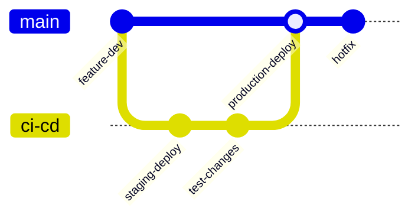

# MMM Trainer System Design Document

## Table of Contents
1. [System Overview](#system-overview)
2. [Architecture](#architecture)
3. [Component Details](#component-details)
4. [Data Flow](#data-flow)
5. [Installation Guide](#installation-guide)
6. [Deployment Pipeline](#deployment-pipeline)
7. [Security & IAM](#security--iam)
8. [Monitoring & Troubleshooting](#monitoring--troubleshooting)

## System Overview

The MMM (Marketing Mix Modeling) Trainer is a cloud-native application built for training and analyzing marketing attribution models using Facebook's Robyn framework. The system consists of a Streamlit web application that orchestrates R-based MMM training jobs and stores results in Google Cloud Storage.

### Key Features
- **Web-based Training Interface**: Streamlit app for configuring and launching MMM training jobs
- **Data Integration**: Connects to Snowflake for input data retrieval
- **Model Training**: Executes R/Robyn workflows in containerized environments
- **Results Visualization**: Web interface for browsing and downloading training artifacts
- **Cloud Storage**: Automatic upload of all training outputs to GCS
- **CI/CD Pipeline**: Automated building and deployment via GitHub Actions

## Architecture

```mermaid
graph TB
    %% User Layer
    User[👤 Data Scientist] --> Web[🌐 Streamlit Web App]
    
    %% Application Layer
    Web --> |Configure Training| Main[📊 Main Training Page]
    Web --> |View Results| Results[📈 Results Browser]
    Web --> |Debug| Debug[🔧 Debug Results]
    
    %% Data Sources
    Main --> |Query Data| SF[(❄️ Snowflake)]
    Main --> |Upload Annotations| Local[📁 Local Files]
    
    %% Processing Layer
    Main --> |Execute| R[🔷 R/Robyn Engine]
    R --> |Load Libraries| Deps[📦 R Dependencies]
    R --> |ML Training| Nevergrad[🧠 Nevergrad/Python]
    
    %% Storage Layer
    R --> |Upload Artifacts| GCS[(☁️ Google Cloud Storage)]
    Results --> |Browse Files| GCS
    
    %% Infrastructure Layer
    Web -.-> |Deployed on| CloudRun[☁️ Cloud Run]
    CloudRun -.-> |Uses| SA[🔐 Service Account]
    SA -.-> |Access| IAM[🛡️ IAM Roles]
    
    %% CI/CD Layer
    GitHub[📋 GitHub Repo] --> |Triggers| Actions[⚡ GitHub Actions]
    Actions --> |Build| Docker[🐳 Docker Image]
    Actions --> |Deploy| Terraform[🏗️ Terraform]
    Terraform --> |Provisions| CloudRun
    Docker --> |Push to| AR[(📦 Artifact Registry)]
    CloudRun --> |Pull from| AR

    classDef user fill:#e1f5fe
    classDef app fill:#f3e5f5
    classDef data fill:#e8f5e8
    classDef infra fill:#fff3e0
    classDef storage fill:#fce4ec
    
    class User user
    class Web,Main,Results,Debug app
    class SF,Local,GCS storage
    class CloudRun,SA,IAM,Actions,Docker,Terraform,AR infra
```



### System Components

| Component | Technology | Purpose |
|-----------|------------|---------|
| **Web Interface** | Streamlit | User interaction, job configuration, results viewing |
| **Training Engine** | R + Robyn | Marketing mix model training and analysis |
| **Optimization** | Python + Nevergrad | Hyperparameter optimization |
| **Data Storage** | Google Cloud Storage | Artifact storage and retrieval |
| **Data Source** | Snowflake | Input data for training |
| **Container Platform** | Cloud Run | Serverless compute environment |
| **Infrastructure** | Terraform | Infrastructure as code |
| **CI/CD** | GitHub Actions | Automated build and deployment |

## Component Details

### 1. Streamlit Application (`app/`)

#### Main Training Interface (`streamlit_app.py`)
- **Purpose**: Primary interface for configuring and launching MMM training jobs
- **Key Features**:
  - Snowflake connection configuration
  - Data source selection (table or custom SQL)
  - Robyn parameter configuration (iterations, trials, variables)
  - Training execution with real-time logging
  - Output configuration (GCS bucket, annotations)

#### Results Browser (`pages/1_results.py`)
- **Purpose**: Web interface for browsing and downloading training artifacts
- **Key Features**:
  - GCS bucket exploration by revision/country/timestamp
  - Automatic onepager detection and display
  - Allocator metrics visualization
  - Signed URL generation for secure downloads
  - Base64 image embedding for immediate preview

#### Debug Results (`pages/2_debug_results.py`)
- **Purpose**: Simplified debugging interface for troubleshooting media file issues
- **Key Features**:
  - Cache clearing functionality
  - Session state inspection
  - Direct file listing and download testing

### 2. R Training Engine (`r/run_all.R`)

#### Data Processing Pipeline

```mermaid
flowchart TD
    Start([🚀 R Script Start]) --> LoadCfg[📋 Load Job Config]
    LoadCfg --> Auth[🔐 GCS Authentication]
    Auth --> LoadData[📊 Load Data from CSV]
    
    LoadData --> Clean[🧹 Data Cleaning]
    Clean --> Country[🌍 Country Filtering]
    Country --> Features[⚙️ Feature Engineering]
    
    Features --> Inputs[📥 Robyn Inputs]
    Inputs --> Hyper[🎯 Hyperparameters]
    Hyper --> Train[🏋️ Model Training]
    
    Train --> Output[📤 Generate Outputs]
    Output --> Onepage[📄 Create Onepagers]
    Onepage --> Allocator[💰 Run Allocator]
    
    Allocator --> Metrics[📊 Calculate Metrics]
    Metrics --> Upload[☁️ Upload to GCS]
    Upload --> End([✅ Complete])
    
    classDef process fill:#e3f2fd
    classDef data fill:#e8f5e8
    classDef output fill:#fff3e0
    
    class LoadCfg,Auth,Clean,Country,Features,Inputs,Hyper process
    class LoadData,Train data
    class Output,Onepage,Allocator,Metrics,Upload output
```


#### Key Processing Steps
1. **Configuration Loading**: Parse job parameters from JSON
2. **Authentication**: Authenticate with GCS using service account
3. **Data Loading**: Read input CSV provided by Streamlit
4. **Data Cleaning**: Handle missing values, duplicates, zero-variance columns
5. **Feature Engineering**: Create derived variables and aggregations
6. **Model Training**: Execute Robyn training with Nevergrad optimization
7. **Output Generation**: Create visualizations and summary reports
8. **Allocation Analysis**: Run budget allocation optimization
9. **Artifact Upload**: Store all outputs in organized GCS structure

### 3. Infrastructure (`infra/terraform/`)

#### Terraform Configuration
- **Service Account**: `mmm-trainer-sa` with necessary GCS and compute permissions
- **Cloud Run Service**: Containerized application deployment
- **IAM Bindings**: Secure access to GCS buckets and Artifact Registry
- **API Enablement**: Required Google Cloud APIs

#### Resource Specifications
```yaml
Cloud Run Service:
  CPU: 4 vCPUs
  Memory: 16 GiB
  Timeout: 3600 seconds (1 hour)
  Concurrency: 1 (single user per instance)
  Service Account: mmm-trainer-sa@datawarehouse-422511.iam.gserviceaccount.com
```

## Data Flow

### Training Job Flow

```mermaid
sequenceDiagram
    participant U as 👤 User
    participant S as 🌐 Streamlit App
    participant SF as ❄️ Snowflake
    participant R as 🔷 R Engine
    participant GCS as ☁️ GCS Bucket
    
    U->>S: Configure training parameters
    U->>S: Submit training job
    
    S->>SF: Query input data
    SF->>S: Return dataset
    
    S->>S: Save data as CSV
    S->>S: Create job.json config
    
    S->>R: Execute Rscript with job config
    
    R->>R: Load and clean data
    R->>R: Feature engineering
    R->>R: Train Robyn models
    R->>R: Generate outputs & allocator
    
    R->>GCS: Upload training artifacts
    R->>GCS: Upload logs and metrics
    
    R->>S: Return exit code
    S->>U: Display training status
    
    Note over GCS: Files stored at:<br/>gs://bucket/robyn/{rev}/{country}/{timestamp}/
```


### Results Browsing Flow

```mermaid
sequenceDiagram
    participant U as 👤 User
    participant S as 🌐 Results Page
    participant GCS as ☁️ GCS Bucket
    participant IAM as 🔐 IAM Service
    
    U->>S: Access results page
    S->>GCS: List blobs with prefix
    GCS->>S: Return file listings
    
    S->>S: Group by revision/country/timestamp
    S->>S: Parse metadata files
    
    U->>S: Select specific run
    S->>GCS: Download file metadata
    
    alt Signed URL Available
        S->>IAM: Request signed URL
        IAM->>S: Return temporary URL
        S->>U: Provide download link
    else Fallback to Data URI
        S->>GCS: Download file content
        GCS->>S: Return file bytes
        S->>S: Encode as base64
        S->>U: Embed in HTML
    end
```


## Installation Guide

### Prerequisites
- Google Cloud Platform project with billing enabled
- GitHub repository with Actions enabled
- Snowflake account and credentials
- Local development environment with:
  - Docker Desktop
  - Terraform >= 1.5.0
  - gcloud CLI

### 1. Initial Setup

#### Clone Repository
```bash
git clone <repository-url>
cd mmm-app
```

#### Configure Environment Variables
Create `.env` file (for local development):
```bash
# Google Cloud
export GOOGLE_APPLICATION_CREDENTIALS=/path/to/service-account.json
export GOOGLE_CLOUD_PROJECT=your-project-id
export GCS_BUCKET=your-output-bucket

# Snowflake (optional for local testing)
export SNOWFLAKE_PASSWORD=your-password
```

### 2. Google Cloud Setup

#### Create Service Accounts
```bash
# Create GitHub deployer service account
gcloud iam service-accounts create github-deployer \
    --display-name="GitHub Actions Deployer"

# Create runtime service account  
gcloud iam service-accounts create mmm-trainer-sa \
    --display-name="MMM Trainer Runtime"
```

#### Enable Required APIs
```bash
gcloud services enable \
    run.googleapis.com \
    artifactregistry.googleapis.com \
    cloudbuild.googleapis.com \
    iamcredentials.googleapis.com \
    storage.googleapis.com
```

#### Create Storage Bucket
```bash
# Create output bucket for training artifacts
gsutil mb gs://your-mmm-output-bucket

# Create Terraform state bucket
gsutil mb gs://your-tf-state-bucket
```

#### Create Artifact Registry Repository
```bash
gcloud artifacts repositories create mmm-repo \
    --repository-format=docker \
    --location=europe-west1
```

### 3. GitHub Actions Setup

#### Configure Workload Identity Federation
```bash
# Create workload identity pool
gcloud iam workload-identity-pools create github-pool \
    --location="global" \
    --display-name="GitHub Actions Pool"

# Create OIDC provider
gcloud iam workload-identity-pools providers create-oidc github-oidc \
    --location="global" \
    --workload-identity-pool="github-pool" \
    --display-name="GitHub Actions Provider" \
    --attribute-mapping="google.subject=assertion.sub,attribute.repository=assertion.repository" \
    --issuer-uri="https://token.actions.githubusercontent.com"

# Bind service account to GitHub repository
gcloud iam service-accounts add-iam-policy-binding \
    --role roles/iam.workloadIdentityUser \
    --member "principalSet://iam.googleapis.com/projects/PROJECT_NUMBER/locations/global/workloadIdentityPools/github-pool/attribute.repository/YOUR_ORG/YOUR_REPO" \
    github-deployer@PROJECT_ID.iam.gserviceaccount.com
```

#### Configure Repository Secrets
In your GitHub repository settings, add these repository variables:
- `GCP_PROJECT_ID`: Your Google Cloud project ID
- `GCP_PROJECT_NUMBER`: Your Google Cloud project number

### 4. Terraform Deployment

#### Initialize Terraform
```bash
cd infra/terraform
terraform init
```

#### Update Configuration
Edit `terraform.tfvars`:
```hcl
project_id  = "your-project-id"
region      = "europe-west1"
bucket_name = "your-output-bucket"
image       = "europe-west1-docker.pkg.dev/your-project-id/mmm-repo/mmm-app:latest"
```

#### Deploy Infrastructure
```bash
terraform plan
terraform apply
```

### 5. Local Development

#### Build and Run Locally
```bash
# Build Docker image
docker build -f docker/Dockerfile -t mmm-app:local .

# Run locally
docker run -p 8080:8080 \
    -e GOOGLE_APPLICATION_CREDENTIALS=/app/credentials.json \
    -v /path/to/credentials.json:/app/credentials.json \
    mmm-app:local
```

#### Test R Environment
```bash
# Test R dependencies
docker run --rm mmm-app:local R -e "library(Robyn); library(reticulate); py_config()"
```

### 6. Deployment via CI/CD

#### Trigger Deployment
```bash
# Deploy to staging (ci-cd branch)
git checkout ci-cd
git push origin ci-cd

# Deploy to production (main branch)  
git checkout main
git push origin main
```

The GitHub Actions workflow will:
1. Build Docker image
2. Push to Artifact Registry
3. Deploy infrastructure with Terraform
4. Update Cloud Run service

## Deployment Pipeline

### CI/CD Workflow



### GitHub Actions Workflows

#### 1. CI Pipeline (`.github/workflows/ci.yml`)
**Trigger**: Push to `ci-cd` branch
**Steps**:
1. Checkout code
2. Authenticate with Google Cloud (OIDC)
3. Configure Docker authentication
4. Build and push Docker image with caching
5. Setup Terraform with plugin caching
6. Import existing service account (if needed)
7. Plan and apply Terraform changes
8. Output service URL

#### 2. Deploy Pipeline (`.github/workflows/deploy.yml`)
**Trigger**: Push to `main` branch
**Steps**:
1. Build and push production image
2. Deploy infrastructure updates
3. Update Cloud Run service
4. Verify deployment

### Deployment Environments

| Environment | Branch | URL Pattern | Purpose |
|-------------|---------|-------------|---------|
| **Staging** | `ci-cd` | `https://mmm-app-staging-*.run.app` | Testing and validation |
| **Production** | `main` | `https://mmm-app-*.run.app` | Live user environment |

## Security & IAM

### Service Account Permissions

#### GitHub Deployer SA (`github-deployer@project.iam.gserviceaccount.com`)
```yaml
Roles:
  - roles/run.admin                    # Deploy Cloud Run services
  - roles/artifactregistry.reader      # Pull Docker images  
  - roles/storage.objectAdmin          # Manage GCS objects
  - roles/iam.serviceAccountUser       # Act as runtime SA
  - roles/iam.serviceAccountTokenCreator # Sign URLs
```

#### Runtime SA (`mmm-trainer-sa@project.iam.gserviceaccount.com`)
```yaml
Roles:
  - roles/storage.objectAdmin          # Read/write training artifacts
  - roles/iam.serviceAccountTokenCreator # Self-sign URLs for downloads
  - roles/artifactregistry.reader      # Pull container images
```

### Security Best Practices

#### Workload Identity Federation
- **No Service Account Keys**: Uses OIDC tokens for GitHub Actions authentication
- **Scoped Access**: Repository-specific binding prevents unauthorized access
- **Short-lived Tokens**: Automatic token rotation and expiration

#### Network Security
- **Cloud Run**: Fully managed with Google's security controls
- **HTTPS Only**: All traffic encrypted in transit
- **Private Container Registry**: Images stored in private Artifact Registry

#### Data Security
- **Signed URLs**: Temporary, scoped access to GCS objects
- **Service Account Impersonation**: Controlled access to cloud resources
- **Encryption**: Data encrypted at rest in GCS and in transit

### Access Control Matrix

| Principal | Resource | Permission | Justification |
|-----------|----------|------------|---------------|
| `github-deployer` | Cloud Run | Admin | Deploy application updates |
| `github-deployer` | Artifact Registry | Reader | Pull container images |
| `github-deployer` | GCS Bucket | Object Admin | Upload training artifacts |
| `mmm-trainer-sa` | GCS Bucket | Object Admin | Runtime read/write access |
| `mmm-trainer-sa` | IAM | Token Creator | Generate signed URLs |
| End Users | Cloud Run | Invoker | Access web application |

## Monitoring & Troubleshooting

### Health Checks

#### Application Health
```bash
# Check Cloud Run service status
gcloud run services describe mmm-app --region=europe-west1

# Check service logs
gcloud logs read "resource.type=cloud_run_revision" --limit=100
```

#### Storage Health
```bash
# Verify GCS bucket access
gsutil ls gs://mmm-app-output/robyn/

# Test signed URL generation
# (via Results page "Run storage self-test" button)
```

### Common Issues & Solutions

#### 1. R Package Installation Failures
**Symptoms**: Docker build fails during R package installation
**Solutions**:
```dockerfile
# Ensure system dependencies are installed
RUN apt-get update && apt-get install -y \
    libcurl4-openssl-dev libssl-dev libxml2-dev \
    libnlopt-dev cmake gfortran

# Install packages with explicit repos
RUN R -e "install.packages('nloptr', repos='https://cloud.r-project.org', type='source')"
```

#### 2. Python/R Integration Issues
**Symptoms**: Reticulate cannot find Python packages
**Solutions**:
```dockerfile
# Set explicit Python path
ENV RETICULATE_PYTHON=/usr/bin/python3
ENV RETICULATE_AUTOCONFIGURE=0

# Install Python packages system-wide
RUN pip3 install nevergrad numpy scipy
```

#### 3. GCS Permission Issues
**Symptoms**: "Access denied" errors when uploading/downloading
**Solutions**:
```bash
# Verify service account has correct roles
gcloud projects get-iam-policy PROJECT_ID \
    --flatten="bindings[].members" \
    --filter="bindings.members:serviceAccount:mmm-trainer-sa*"

# Test bucket access manually
gsutil -i mmm-trainer-sa@project.iam.gserviceaccount.com ls gs://bucket-name/
```

#### 4. Memory/Timeout Issues
**Symptoms**: Cloud Run instances killed due to resource limits
**Solutions**:
```hcl
# Increase Cloud Run resources
resource "google_cloud_run_service" "svc" {
  template {
    spec {
      container_concurrency = 1
      timeout_seconds       = 3600  # 1 hour
      
      containers {
        resources {
          limits = {
            cpu    = "4"      # Increase CPU
            memory = "16Gi"   # Increase memory
          }
        }
      }
    }
  }
}
```

### Logging Strategy

#### Structured Logging Locations
```yaml
Training Logs:
  Location: "gs://bucket/robyn/{rev}/{country}/{timestamp}/robyn_console.log"
  Content: Complete R execution output, errors, warnings

Application Logs:
  Location: "Cloud Logging > Cloud Run > mmm-app"  
  Content: Streamlit app logs, user interactions

System Logs:
  Location: "Cloud Logging > Cloud Run > mmm-app (system)"
  Content: Container startup, health checks, resource usage

Deployment Logs:
  Location: "GitHub Actions workflow logs"
  Content: Build process, Terraform execution, deployment status
```

#### Log Analysis Queries
```sql
-- Find training failures
SELECT timestamp, jsonPayload.message 
FROM `project.cloud_run_logs` 
WHERE jsonPayload.message CONTAINS "FATAL ERROR"
ORDER BY timestamp DESC LIMIT 10

-- Monitor resource usage
SELECT timestamp, jsonPayload.memory_usage_mb
FROM `project.cloud_run_logs`  
WHERE jsonPayload.memory_usage_mb > 8000
ORDER BY timestamp DESC
```

### Performance Optimization

#### Container Optimization
- **Multi-stage builds**: Reduce final image size
- **Layer caching**: Leverage GitHub Actions cache for faster builds
- **Base image selection**: Use optimized R/Python base images

#### Resource Allocation
- **CPU**: 4 vCPUs for parallel R processing
- **Memory**: 16 GiB for large dataset handling
- **Timeout**: 1 hour for complex training jobs
- **Concurrency**: 1 to prevent resource conflicts

#### Storage Optimization
- **GCS lifecycle policies**: Automatic cleanup of old training runs
- **Compression**: Gzip compression for text files
- **Signed URLs**: Reduce egress costs through direct downloads

---

## Conclusion

The MMM Trainer system provides a robust, scalable platform for marketing mix modeling with comprehensive automation, security, and monitoring capabilities. The cloud-native architecture ensures reliable execution of complex R/Python workloads while maintaining ease of use through the Streamlit web interface.

For additional support or questions, refer to the troubleshooting section or contact the development team.