# MMM Trainer System Design Document

## Table of Contents
1. [System Overview](#system-overview)
2. [Architecture](#architecture)
3. [Component Details](#component-details)
4. [Data Flow](#data-flow)
5. [Installation Guide](#installation-guide)
6. [Deployment Pipeline](#deployment-pipeline)
7. [Security & IAM](#security--iam)
8. [Monitoring & Troubleshooting](#monitoring--troubleshooting)

## System Overview

The MMM (Marketing Mix Modeling) Trainer is a cloud-native application built for training and analyzing marketing attribution models using Facebook's Robyn framework. The system consists of a Streamlit web application that orchestrates R-based MMM training jobs and stores results in Google Cloud Storage.

### Key Features
- **Web-based Training Interface**: Streamlit app for configuring and launching MMM training jobs
- **Data Integration**: Connects to Snowflake for input data retrieval
- **Model Training**: Executes R/Robyn workflows in containerized environments
- **Results Visualization**: Web interface for browsing and downloading training artifacts
- **Cloud Storage**: Automatic upload of all training outputs to GCS
- **CI/CD Pipeline**: Automated building and deployment via GitHub Actions

## Architecture

```mermaid
graph TB
    %% User Layer
    User[👤 Data Scientist] --> Web[🌐 Streamlit Web App]
    
    %% Application Layer
    Web --> |Configure Training| Main[📊 Main Training Page]
    Web --> |View Results| Results[📈 Results Browser]
    Web --> |Debug| Debug[🔧 Debug Results]
    
    %% Data Sources
    Main --> |Query Data| SF[(❄️ Snowflake)]
    Main --> |Upload Annotations| Local[📁 Local Files]
    
    %% Processing Layer
    Main --> |Execute| R[🔷 R/Robyn Engine]
    R --> |Load Libraries| Deps[📦 R Dependencies]
    R --> |ML Training| Nevergrad[🧠 Nevergrad/Python]
    
    %% Storage Layer
    R --> |Upload Artifacts| GCS[(☁️ Google Cloud Storage)]
    Results --> |Browse Files| GCS
    
    %% Infrastructure Layer
    Web -.-> |Deployed on| CloudRun[☁️ Cloud Run]
    CloudRun -.-> |Uses| SA[🔐 Service Account]
    SA -.-> |Access| IAM[🛡️ IAM Roles]
    
    %% CI/CD Layer
    GitHub[📋 GitHub Repo] --> |Triggers| Actions[⚡ GitHub Actions]
    Actions --> |Build| Docker[🐳 Docker Image]
    Actions --> |Deploy| Terraform[🏗️ Terraform]
    Terraform --> |Provisions| CloudRun
    Docker --> |Push to| AR[(📦 Artifact Registry)]
    CloudRun --> |Pull from| AR

    classDef user fill:#e1f5fe
    classDef app fill:#f3e5f5
    classDef data fill:#e8f5e8
    classDef infra fill:#fff3e0
    classDef storage fill:#fce4ec
    
    class User user
    class Web,Main,Results,Debug app
    class SF,Local,GCS storage
    class CloudRun,SA,IAM,Actions,Docker,Terraform,AR infra
```

### System Components

| Component | Technology | Purpose |
|-----------|------------|---------|
| **Web Interface** | Streamlit | User interaction, job configuration, results viewing |
| **Training Engine** | R + Robyn | Marketing mix model training and analysis |
| **Optimization** | Python + Nevergrad | Hyperparameter optimization |
| **Data Storage** | Google Cloud Storage | Artifact storage and retrieval |
| **Data Source** | Snowflake | Input data for training |
| **Container Platform** | Cloud Run | Serverless compute environment |
| **Infrastructure** | Terraform | Infrastructure as code |
| **CI/CD** | GitHub Actions | Automated build and deployment |

## Component Details

### 1. Streamlit Application (`app/`)

#### Main Training Interface (`streamlit_app.py`)
- **Purpose**: Primary interface for configuring and launching MMM training jobs
- **Key Features**:
  - Snowflake connection configuration
  - Data source selection (table or custom SQL)
  - Robyn parameter configuration (iterations, trials, variables)
  - Training execution with real-time logging
  - Output configuration (GCS bucket, annotations)

#### Results Browser (`pages/1_results.py`)
- **Purpose**: Web interface for browsing and downloading training artifacts
- **Key Features**:
  - GCS bucket exploration by revision/country/timestamp
  - Automatic onepager detection and display
  - Allocator metrics visualization
  - Signed URL generation for secure downloads
  - Base64 image embedding for immediate preview

#### Debug Results (`pages/2_debug_results.py`)
- **Purpose**: Simplified debugging interface for troubleshooting media file issues
- **Key Features**:
  - Cache clearing functionality
  - Session state inspection
  - Direct file listing and download testing

### 2. R Training Engine (`r/run_all.R`)

#### Data Processing Pipeline
```mermaid
flowchart TD
    Start([🚀 R Script Start]) --> LoadCfg[📋 Load Job Config]
    LoadCfg --> Auth[🔐 GCS Authentication]
    Auth --> LoadData[📊 Load Data from CSV]
    
    LoadData --> Clean[🧹 Data Cleaning]
    Clean --> Country[🌍 Country Filtering]
    Country --> Features[⚙️ Feature Engineering]
    
    Features --> Inputs[📥 Robyn Inputs]
    Inputs --> Hyper[🎯 Hyperparameters]
    Hyper --> Train[🏋️ Model Training]
    
    Train --> Output[📤 Generate Outputs]
    Output --> Onepage[📄 Create Onepagers]
    Onepage --> Allocator[💰 Run Allocator]
    
    Allocator --> Metrics[📊 Calculate Metrics]
    Metrics --> Upload[☁️ Upload to GCS]
    Upload --> End([✅ Complete])
    
    classDef process fill:#e3f2fd
    classDef data fill:#e8f5e8
    classDef output fill:#fff3e0
    
    class LoadCfg,Auth,Clean,Country,Features,Inputs,Hyper process
    class LoadData,Train data
    class Output,Onepage,Allocator,Metrics,Upload output
```

#### Key Processing Steps
1. **Configuration Loading**: Parse job parameters from JSON
2. **Authentication**: Authenticate with GCS using service account
3. **Data Loading**: Read input CSV provided by Streamlit
4. **Data Cleaning**: Handle missing values, duplicates, zero-variance columns
5. **Feature Engineering**: Create derived variables and aggregations
6. **Model Training**: Execute Robyn training with Nevergrad optimization
7. **Output Generation**: Create visualizations and summary reports
8. **Allocation Analysis**: Run budget allocation optimization
9. **Artifact Upload**: Store all outputs in organized GCS structure

### 3. Infrastructure (`infra/terraform/`)

#### Terraform Configuration
- **Service Account**: `mmm-trainer-sa` with necessary GCS and compute permissions
- **Cloud Run Service**: Containerized application deployment
- **IAM Bindings**: Secure access to GCS buckets and Artifact Registry
- **API Enablement**: Required Google Cloud APIs

#### Resource Specifications
```yaml
Cloud Run Service:
  CPU: 4 vCPUs
  Memory: 16 GiB
  Timeout: 3600 seconds (1 hour)
  Concurrency: 1 (single user per instance)
  Service Account: mmm-trainer-sa@datawarehouse-422511.iam.gserviceaccount.com
```

## Data Flow

### Training Job Flow
```mermaid
sequenceDiagram
    participant U as 👤 User
    participant S as 🌐 Streamlit App
    participant SF as ❄️ Snowflake
    participant R as 🔷 R Engine
    participant GCS as ☁️ GCS Bucket
    
    U->>S: Configure training parameters
    U->>S: Submit training job
    
    S->>SF: Query input data
    SF->>S: Return dataset
    
    S->>S: Save data as CSV
    S->>S: Create job.json config
    
    S->>R: Execute Rscript with job config
    
    R->>R: Load and clean data
    R->>R: Feature engineering
    R->>R: Train Robyn models
    R->>R: Generate outputs & allocator
    
    R->>GCS: Upload training artifacts
    R->>GCS: Upload logs and metrics
    
    R->>S: Return exit code
    S->>U: Display training status
    
    Note over GCS: Files stored at:<br/>gs://bucket/robyn/{rev}/{country}/{timestamp}/
```

### Results Browsing Flow
```mermaid
sequenceDiagram
    participant U as 👤 User
    participant S as 🌐 Results Page
    participant GCS as ☁️ GCS Bucket
    participant IAM as 🔐 IAM Service
    
    U->>S: Access results page
    S->>GCS: List blobs with prefix
    GCS->>S: Return file listings
    
    S->>S: Group by revision/country/timestamp
    S->>S: Parse metadata files
    
    U->>S: Select specific run
    S->>GCS: Download file metadata
    
    alt Signed URL Available
        S->>IAM: Request signed URL
        IAM->>S: Return temporary URL
        S->>U: Provide download link
    else Fallback to Data URI
        S->>GCS: Download file content
        GCS->>S: Return file bytes
        S->>S: Encode as base64
        S->>U: Embed in HTML
    end
```

## Installation Guide

### Prerequisites
- Google Cloud Platform project with billing enabled
- GitHub repository with Actions enabled
- Snowflake account and credentials
- Local development environment with:
  - Docker Desktop
  - Terraform >= 1.5.0
  - gcloud CLI

### 1. Initial Setup

#### Clone Repository
```bash
git clone <repository-url>
cd mmm-app
```

#### Configure Environment Variables
Create `.env` file (for local development):
```bash
# Google Cloud
export GOOGLE_APPLICATION_CREDENTIALS=/path/to/service-account.json
export GOOGLE_CLOUD_PROJECT=your-project-id
export GCS_BUCKET=your-output-bucket

# Snowflake (optional for local testing)
export SNOWFLAKE_PASSWORD=your-password
```

### 2. Google Cloud Setup

#### Create Service Accounts
```bash
# Create GitHub deployer service account
gcloud iam service-accounts create github-deployer \
    --display-name="GitHub Actions Deployer"

# Create runtime service account  
gcloud iam service-accounts create mmm-trainer-sa \
    --display-name="MMM Trainer Runtime"
```

#### Enable Required APIs
```bash
gcloud services enable \
    run.googleapis.com \
    artifactregistry.googleapis.com \
    cloudbuild.googleapis.com \
    iamcredentials.googleapis.com \
    storage.googleapis.com
```

#### Create Storage Bucket
```bash
# Create output bucket for training artifacts
gsutil mb gs://your-mmm-output-bucket

# Create Terraform state bucket
gsutil mb gs://your-tf-state-bucket
```

#### Create Artifact Registry Repository
```bash
gcloud artifacts repositories create mmm-repo \
    --repository-format=docker \
    --location=europe-west1
```

### 3. GitHub Actions Setup

#### Configure Workload Identity Federation
```bash
# Create workload identity pool
gcloud iam workload-identity-pools create github-pool \
    --location="global" \
    --display-name="GitHub Actions Pool"

# Create OIDC provider
gcloud iam workload-identity-pools providers create-oidc github-oidc \
    --location="global" \
    --workload-identity-pool="github-pool" \
    --display-name="GitHub Actions Provider" \
    --attribute-mapping="google.subject=assertion.sub,attribute.repository=assertion.repository" \
    --issuer-uri="https://token.actions.githubusercontent.com"

# Bind service account to GitHub repository
gcloud iam service-accounts add-iam-policy-binding \
    --role roles/iam.workloadIdentityUser \
    --member "principalSet://iam.googleapis.com/projects/PROJECT_NUMBER/locations/global/workloadIdentityPools/github-pool/attribute.repository/YOUR_ORG/YOUR_REPO" \
    github-deployer@PROJECT_ID.iam.gserviceaccount.com
```

#### Configure Repository Secrets
In your GitHub repository settings, add these repository variables:
- `GCP_PROJECT_ID`: Your Google Cloud project ID
- `GCP_PROJECT_NUMBER`: Your Google Cloud project number

### 4. Terraform Deployment

#### Initialize Terraform
```bash
cd infra/terraform
terraform init
```

#### Update Configuration
Edit `terraform.tfvars`:
```hcl
project_id  = "your-project-id"
region      = "europe-west1"
bucket_name = "your-output-bucket"
image       = "europe-west1-docker.pkg.dev/your-project-id/mmm-repo/mmm-app:latest"
```

#### Deploy Infrastructure
```bash
terraform plan
terraform apply
```

### 5. Local Development

#### Build and Run Locally
```bash
# Build Docker image
docker build -f docker/Dockerfile -t mmm-app:local .

# Run locally
docker run -p 8080:8080 \
    -e GOOGLE_APPLICATION_CREDENTIALS=/app/credentials.json \
    -v /path/to/credentials.json:/app/credentials.json \
    mmm-app:local
```

#### Test R Environment
```bash
# Test R dependencies
docker run --rm mmm-app:local R -e "library(Robyn); library(reticulate); py_config()"
```

### 6. Deployment via CI/CD

#### Trigger Deployment
```bash
# Deploy to staging (ci-cd branch)
git checkout ci-cd
git push origin ci-cd

# Deploy to production (main branch)  
git checkout main
git push origin main
```

The GitHub Actions workflow will:
1. Build Docker image
2. Push to Artifact Registry
3. Deploy infrastructure with Terraform
4. Update Cloud Run service

## Deployment Pipeline

### CI/CD Workflow

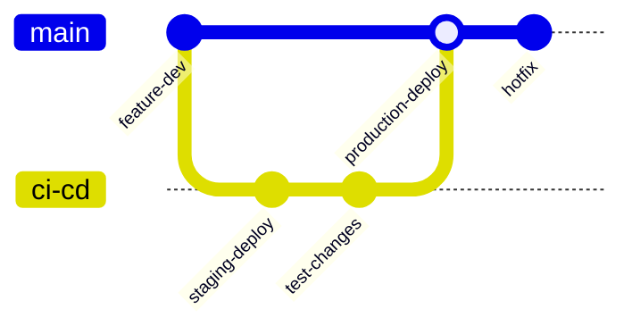

### GitHub Actions Workflows

#### 1. CI Pipeline (`.github/workflows/ci.yml`)
**Trigger**: Push to `ci-cd` branch
**Steps**:
1. Checkout code
2. Authenticate with Google Cloud (OIDC)
3. Configure Docker authentication
4. Build and push Docker image with caching
5. Setup Terraform with plugin caching
6. Import existing service account (if needed)
7. Plan and apply Terraform changes
8. Output service URL

#### 2. Deploy Pipeline (`.github/workflows/deploy.yml`)
**Trigger**: Push to `main` branch
**Steps**:
1. Build and push production image
2. Deploy infrastructure updates
3. Update Cloud Run service
4. Verify deployment

### Deployment Environments

| Environment | Branch | URL Pattern | Purpose |
|-------------|---------|-------------|---------|
| **Staging** | `ci-cd` | `https://mmm-app-staging-*.run.app` | Testing and validation |
| **Production** | `main` | `https://mmm-app-*.run.app` | Live user environment |

## Google Cloud Platform Architecture

### GCP Services Overview

The MMM Trainer leverages multiple Google Cloud services to provide a scalable, secure, and managed infrastructure. Here's a detailed breakdown of each component:

```mermaid
graph TB
    subgraph "Identity & Access"
        WIF[🔐 Workload Identity Federation]
        SA1[🤖 github-deployer SA]
        SA2[🤖 mmm-trainer-sa SA]
        IAM[🛡️ Cloud IAM]
    end
    
    subgraph "Compute & Container"
        CR[☁️ Cloud Run]
        AR[📦 Artifact Registry]
        CB[🔨 Cloud Build]
    end
    
    subgraph "Storage & Data"
        GCS[🗄️ Cloud Storage]
        GCSL[📋 Cloud Logging]
    end
    
    subgraph "APIs & Services"
        API1[🌐 Cloud Run API]
        API2[🌐 Artifact Registry API]
        API3[🌐 IAM Credentials API]
        API4[🌐 Cloud Storage API]
        API5[🌐 Cloud Build API]
    end
    
    subgraph "External Integrations"
        GH[📋 GitHub Actions]
        SF[❄️ Snowflake]
        USER[👤 End Users]
    end
    
    %% Identity flows
    GH -.->|OIDC Authentication| WIF
    WIF --> SA1
    SA1 -.->|Impersonate| SA2
    IAM --> SA1
    IAM --> SA2
    
    %% Compute flows
    SA1 -->|Deploy| CR
    SA1 -->|Push Images| AR
    CR -->|Pull Images| AR
    CB -.->|Build Support| AR
    
    %% Storage flows
    SA2 -->|Read/Write Artifacts| GCS
    CR -->|Application Logs| GCSL
    SA2 -.->|Generate Signed URLs| GCS
    
    %% API enablement
    CR --> API1
    AR --> API2
    SA2 --> API3
    GCS --> API4
    CB --> API5
    
    %% External connections
    USER -->|HTTPS Requests| CR
    CR -->|Query Data| SF
    
    classDef identity fill:#e8f5e8
    classDef compute fill:#e3f2fd
    classDef storage fill:#fff3e0
    classDef api fill:#f3e5f5
    classDef external fill:#fce4ec
    
    class WIF,SA1,SA2,IAM identity
    class CR,AR,CB compute
    class GCS,GCSL storage
    class API1,API2,API3,API4,API5 api
    class GH,SF,USER external
```

### Detailed GCP Component Analysis

#### 1. Cloud Run Service

**Configuration & Specifications**
```yaml
Service Name: mmm-app
Region: europe-west1
Platform: managed
Traffic: 100% to latest revision

Resource Limits:
  CPU: 4 vCPU (always allocated)
  Memory: 16 GiB
  Request Timeout: 3600 seconds (1 hour)
  Container Concurrency: 1 (single user per instance)

Networking:
  Ingress: Allow all traffic
  Authentication: Allow unauthenticated invocations
  Port: 8080

Environment Variables:
  GCS_BUCKET: mmm-app-output
  APP_ROOT: /app
  RUN_SERVICE_ACCOUNT_EMAIL: mmm-trainer-sa@project.iam.gserviceaccount.com
```

**Scaling Behavior**
```mermaid
graph LR
    subgraph "Auto-scaling Logic"
        IDLE[🟢 0 Instances<br/>No Traffic] 
        COLD[🟡 Cold Start<br/>~30-60 seconds]
        WARM[🟢 1 Instance<br/>Serving Requests]
        SCALE[🔵 2+ Instances<br/>High Concurrency]
    end
    
    IDLE -->|First Request| COLD
    COLD -->|Container Ready| WARM
    WARM -->|Traffic Spike| SCALE
    SCALE -->|Traffic Decreases| WARM
    WARM -->|15 min idle| IDLE
    
    classDef active fill:#c8e6c9
    classDef scaling fill:#bbdefb
    classDef idle fill:#fff9c4
    
    class WARM,SCALE active
    class COLD scaling
    class IDLE idle
```

#### 2. Artifact Registry

**Repository Structure**
```mermaid
graph TB
    subgraph "Artifact Registry Repository"
        REPO[📦 mmm-repo<br/>Format: Docker<br/>Location: europe-west1]
        
        subgraph "Images"
            LATEST[🏷️ mmm-app:latest<br/>Production Image]
            SHA[🏷️ mmm-app:abc123<br/>Commit SHA Tag]
        end
        
        subgraph "Metadata"
            SIZE[📏 Size: ~2.5 GB]
            LAYERS[📚 Layers: 25+]
            SCAN[🔍 Vulnerability Scanning]
        end
        
        REPO --> LATEST
        REPO --> SHA
        REPO --> SIZE
        REPO --> LAYERS
        REPO --> SCAN
    end
    
    subgraph "Access Control"
        SA1[🤖 github-deployer<br/>roles/artifactregistry.writer]
        SA2[🤖 mmm-trainer-sa<br/>roles/artifactregistry.reader]
        CR[☁️ Cloud Run<br/>Pull Access]
    end
    
    SA1 -.->|Push Images| REPO
    SA2 -.->|Pull Images| REPO
    CR -.->|Runtime Pull| REPO
    
    classDef registry fill:#e3f2fd
    classDef access fill:#e8f5e8
    
    class REPO,LATEST,SHA,SIZE,LAYERS,SCAN registry
    class SA1,SA2,CR access
```

#### 3. Cloud Storage Architecture

**Bucket Structure & Organization**
```mermaid
graph TB
    subgraph "Primary Storage Bucket: mmm-app-output"
        ROOT[🗄️ mmm-app-output/]
        
        subgraph "Organized Hierarchy"
            ROBYN[📁 robyn/]
            
            subgraph "Revision Level"
                R100[📁 r100/]
                R101[📁 r101/]
                R102[📁 r102/]
            end
            
            subgraph "Country Level (under r100/)"
                FR[📁 fr/]
                DE[📁 de/]
                UK[📁 uk/]
            end
            
            subgraph "Timestamp Level (under fr/)"
                TS1[📁 0827_143022/]
                TS2[📁 0827_151505/]
                TS3[📁 0828_093011/]
            end
            
            subgraph "Artifacts (under 0827_143022/)"
                FILES[📄 best_model_id.txt<br/>📊 allocator_metrics.csv<br/>📈 1_7_3.png<br/>📋 robyn_console.log<br/>🔬 OutputModels.RDS<br/>📊 InputCollect.RDS]
            end
        end
    end
    
    ROOT --> ROBYN
    ROBYN --> R100
    ROBYN --> R101
    ROBYN --> R102
    R100 --> FR
    R100 --> DE
    R100 --> UK
    FR --> TS1
    FR --> TS2
    FR --> TS3
    TS1 --> FILES
    
    classDef bucket fill:#fff3e0
    classDef folder fill:#e8f5e8
    classDef files fill:#e3f2fd
    
    class ROOT bucket
    class ROBYN,R100,R101,R102,FR,DE,UK,TS1,TS2,TS3 folder
    class FILES files
```

**Storage Access Patterns**
```mermaid
sequenceDiagram
    participant R as 🔷 R Training Process
    participant SA as 🤖 mmm-trainer-sa
    participant GCS as 🗄️ Cloud Storage
    participant WEB as 🌐 Streamlit App
    participant USER as 👤 End User
    
    Note over R,GCS: Training Phase - Write Operations
    R->>SA: Authenticate with service account
    SA->>GCS: Create directory structure
    R->>GCS: Upload training artifacts
    R->>GCS: Upload logs and metrics
    R->>GCS: Upload visualizations (PNG/PDF)
    
    Note over WEB,USER: Browsing Phase - Read Operations
    USER->>WEB: Access Results page
    WEB->>SA: Authenticate for listing
    SA->>GCS: List objects with prefix filter
    GCS->>WEB: Return object metadata
    
    USER->>WEB: Request file download
    WEB->>SA: Generate signed URL
    SA->>GCS: Create temporary access token
    GCS->>WEB: Return signed URL (valid 60 min)
    WEB->>USER: Provide download link
    USER->>GCS: Direct download via signed URL
```

#### 4. IAM & Service Accounts Deep Dive

**Service Account Architecture**
```mermaid
graph TB
    subgraph "GitHub Actions Context"
        GH[📋 GitHub Repository]
        OIDC[🔐 OIDC Token]
        WIF[🌐 Workload Identity Federation]
    end
    
    subgraph "Service Accounts"
        subgraph "Deployment SA"
            SA1[🤖 github-deployer@project.iam.gserviceaccount.com]
            SA1ROLES[🛡️ Roles:<br/>• roles/run.admin<br/>• roles/artifactregistry.reader<br/>• roles/storage.objectAdmin<br/>• roles/iam.serviceAccountUser<br/>• roles/iam.serviceAccountTokenCreator]
        end
        
        subgraph "Runtime SA"
            SA2[🤖 mmm-trainer-sa@project.iam.gserviceaccount.com]
            SA2ROLES[🛡️ Roles:<br/>• roles/storage.objectAdmin<br/>• roles/iam.serviceAccountTokenCreator<br/>• roles/artifactregistry.reader]
        end
    end
    
    subgraph "Resource Access"
        CR[☁️ Cloud Run Service]
        AR[📦 Artifact Registry]
        GCS[🗄️ Cloud Storage]
        IAM_API[🌐 IAM Credentials API]
    end
    
    GH --> OIDC
    OIDC --> WIF
    WIF --> SA1
    
    SA1 --> SA1ROLES
    SA1 -->|Deploy & Configure| CR
    SA1 -->|Pull Images| AR
    SA1 -->|Upload Artifacts| GCS
    SA1 -->|Impersonate| SA2
    
    SA2 --> SA2ROLES
    SA2 -->|Runtime Storage| GCS
    SA2 -->|Sign URLs| IAM_API
    SA2 -->|Pull Images| AR
    
    CR -.->|Runs As| SA2
    
    classDef github fill:#f0f8ff
    classDef sa fill:#e8f5e8
    classDef resources fill:#fff3e0
    classDef roles fill:#f3e5f5
    
    class GH,OIDC,WIF github
    class SA1,SA2 sa
    class CR,AR,GCS,IAM_API resources
    class SA1ROLES,SA2ROLES roles
```

**IAM Permission Flow**
```mermaid
flowchart TD
    START([🚀 GitHub Action Triggered]) --> AUTH{🔐 Authentication}
    
    AUTH -->|OIDC Token| WIF[🌐 Workload Identity Federation]
    WIF --> VERIFY{✅ Verify Repository}
    VERIFY -->|Match| ASSUME[🤖 Assume github-deployer SA]
    VERIFY -->|No Match| DENY[❌ Access Denied]
    
    ASSUME --> CHECK_PERMS{🛡️ Check Permissions}
    CHECK_PERMS -->|Has roles/run.admin| DEPLOY[🚀 Deploy Cloud Run]
    CHECK_PERMS -->|Has roles/artifactregistry.reader| PULL[📦 Pull Images]
    CHECK_PERMS -->|Has roles/storage.objectAdmin| UPLOAD[📤 Upload Artifacts]
    CHECK_PERMS -->|Has roles/iam.serviceAccountUser| IMPERSONATE[🔄 Impersonate Runtime SA]
    
    DEPLOY --> SUCCESS[✅ Deployment Complete]
    PULL --> SUCCESS
    UPLOAD --> SUCCESS
    IMPERSONATE --> SUCCESS
    
    classDef auth fill:#e8f5e8
    classDef decision fill:#fff3e0
    classDef action fill:#e3f2fd
    classDef result fill:#c8e6c9
    classDef error fill:#ffcdd2
    
    class AUTH,WIF,ASSUME,IMPERSONATE auth
    class VERIFY,CHECK_PERMS decision
    class DEPLOY,PULL,UPLOAD action
    class SUCCESS result
    class DENY error
```

#### 5. Network & Security Architecture

**Security Boundaries**
```mermaid
graph TB
    subgraph "Internet"
        USER[👤 End Users]
        GH_RUNNERS[🏃 GitHub Actions Runners]
    end
    
    subgraph "Google Cloud Platform"
        subgraph "Global Load Balancer"
            GLB[🌐 HTTPS Load Balancer<br/>SSL Termination]
        end
        
        subgraph "europe-west1 Region"
            subgraph "Managed Services"
                CR[☁️ Cloud Run<br/>Fully Managed]
                AR[📦 Artifact Registry<br/>Private Repository]
                GCS[🗄️ Cloud Storage<br/>Private Bucket]
            end
            
            subgraph "Identity & Access"
                IAM[🛡️ Cloud IAM]
                WIF[🔐 Workload Identity Federation]
            end
        end
        
        subgraph "Global Services"
            GCSL[📋 Cloud Logging]
            MON[📊 Cloud Monitoring]
        end
    end
    
    subgraph "External Services"
        SF[❄️ Snowflake<br/>Data Warehouse]
    end
    
    %% Network flows
    USER -->|HTTPS Only| GLB
    GLB -->|Internal| CR
    GH_RUNNERS -.->|OIDC| WIF
    WIF -.->|Federated Auth| IAM
    
    %% Service connections
    CR -->|Private Network| GCS
    CR -->|Private Network| AR
    CR -->|Service Auth| IAM
    CR -->|Egress| SF
    
    %% Observability
    CR -->|Logs| GCSL
    CR -->|Metrics| MON
    
    classDef internet fill:#ffebee
    classDef gcp fill:#e8f5e8
    classDef managed fill:#e3f2fd
    classDef security fill:#fff3e0
    classDef external fill:#f3e5f5
    
    class USER,GH_RUNNERS internet
    class GLB,CR,AR,GCS,IAM,WIF,GCSL,MON gcp
    class CR,AR,GCS managed
    class IAM,WIF security
    class SF external
```

**Data Flow & Security Controls**
```mermaid
sequenceDiagram
    participant U as 👤 User (Internet)
    participant GLB as 🌐 Global Load Balancer
    participant CR as ☁️ Cloud Run
    participant SA as 🤖 Service Account
    participant GCS as 🗄️ Cloud Storage
    participant SF as ❄️ Snowflake
    
    Note over U,SF: Secure Data Flow
    
    U->>GLB: HTTPS Request (TLS 1.3)
    GLB->>CR: Internal routing (encrypted)
    
    Note over CR: Authentication & Authorization
    CR->>SA: Authenticate with metadata server
    SA->>CR: Return access tokens
    
    Note over CR,GCS: Secure Storage Operations
    CR->>GCS: API call with OAuth2 token
    GCS->>CR: Return data (encrypted in transit)
    
    Note over CR,SF: External Data Query
    CR->>SF: TLS connection with credentials
    SF->>CR: Return query results
    
    Note over CR,U: Signed URL Generation
    CR->>SA: Request signed URL
    SA->>GCS: Generate temporary access token
    GCS->>SA: Return signed URL (60 min TTL)
    SA->>CR: Provide signed URL
    CR->>U: Return signed URL
    U->>GCS: Direct download (bypasses Cloud Run)
    
    rect rgba(255, 0, 0, 0.1)
        Note over U,GCS: All traffic encrypted end-to-end
    end
    
    rect rgba(0, 255, 0, 0.1)
        Note over SA,GCS: No persistent credentials stored
    end
```

#### 6. Cost Optimization & Resource Management

**Resource Utilization Patterns**
```mermaid
gantt
    title Cloud Run Instance Lifecycle
    dateFormat X
    axisFormat %M:%S
    
    section Instance 1
    Cold Start     :crit, cold1, 0, 60
    Warm Serving   :active, warm1, 60, 1800
    Training Job   :done, train1, 1800, 5400
    Idle Timeout   :milestone, idle1, 5400
    
    section Instance 2  
    Cold Start     :crit, cold2, 300, 360
    Warm Serving   :active, warm2, 360, 1200
    Idle Timeout   :milestone, idle2, 1200
    
    section Cost Impact
    Billing Start  :milestone, bill1, 60
    Peak Usage     :crit, peak, 1800, 5400
    Billing End    :milestone, bill2, 5400
```

**Cost Breakdown Analysis**
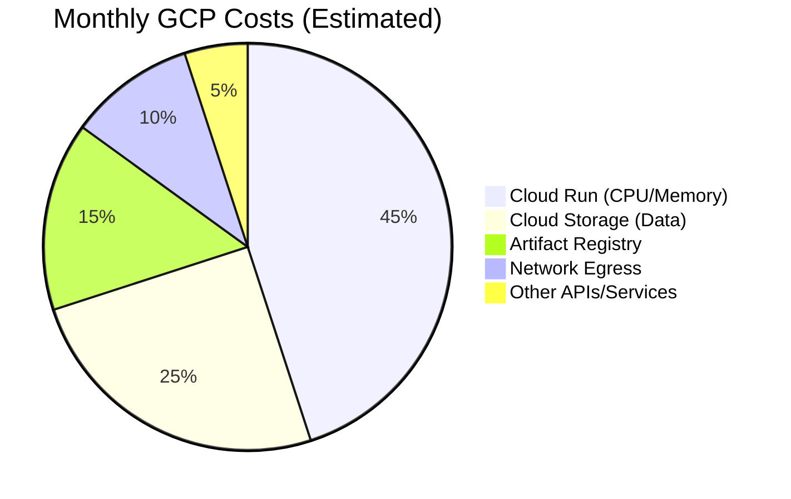

### GCP Service Dependencies

**API Dependencies Matrix**
| Service | Required APIs | Purpose |
|---------|---------------|---------|
| **Cloud Run** | `run.googleapis.com` | Container orchestration |
| **Artifact Registry** | `artifactregistry.googleapis.com` | Container image storage |
| **Cloud Storage** | `storage.googleapis.com` | Artifact storage |
| **IAM Credentials** | `iamcredentials.googleapis.com` | Signed URL generation |
| **Cloud Build** | `cloudbuild.googleapis.com` | Image building (if needed) |
| **Cloud Logging** | `logging.googleapis.com` | Application logs |

**Resource Quotas & Limits**
```yaml
Cloud Run Quotas:
  Requests per minute: 60,000
  Concurrent requests: 1,000
  Memory per instance: 32 GiB (max)
  CPU per instance: 8 vCPU (max)
  Request timeout: 3,600 seconds (max)

Cloud Storage Quotas:
  Upload bandwidth: 5 TiB/day
  Download bandwidth: 10 TiB/day
  Operations per second: 5,000

Artifact Registry Quotas:
  Storage: 1 TiB (default)
  Bandwidth: 1 TiB/day
  API requests: 30,000/day
```

### Monitoring & Observability

**Cloud Logging Structure**
```yaml
Log Sources:
  - resource.type = "cloud_run_revision"
    - Application logs (stdout/stderr)
    - Request logs (HTTP access)
    - System logs (container lifecycle)
  
  - resource.type = "gcs_bucket"  
    - Storage access logs
    - Object lifecycle events
    
  - resource.type = "artifact_registry"
    - Image push/pull events
    - Vulnerability scan results

Log Retention:
  - Default: 30 days
  - Custom: Up to 10 years (configurable)
```

**Key Metrics Dashboard**
```yaml
Cloud Run Metrics:
  - Request count and latency
  - Instance count and utilization  
  - Memory and CPU usage
  - Cold start frequency
  
Storage Metrics:
  - Object count and total size
  - Request rate and bandwidth
  - Error rates by operation
  
Cost Metrics:
  - Daily/monthly spend by service
  - Resource utilization efficiency
  - Scaling patterns and trends
```

## Security & IAM

### Service Account Permissions

#### GitHub Deployer SA (`github-deployer@project.iam.gserviceaccount.com`)
```yaml
Roles:
  - roles/run.admin                    # Deploy Cloud Run services
  - roles/artifactregistry.reader      # Pull Docker images  
  - roles/storage.objectAdmin          # Manage GCS objects
  - roles/iam.serviceAccountUser       # Act as runtime SA
  - roles/iam.serviceAccountTokenCreator # Sign URLs
```

#### Runtime SA (`mmm-trainer-sa@project.iam.gserviceaccount.com`)
```yaml
Roles:
  - roles/storage.objectAdmin          # Read/write training artifacts
  - roles/iam.serviceAccountTokenCreator # Self-sign URLs for downloads
  - roles/artifactregistry.reader      # Pull container images
```

### Security Best Practices

#### Workload Identity Federation
- **No Service Account Keys**: Uses OIDC tokens for GitHub Actions authentication
- **Scoped Access**: Repository-specific binding prevents unauthorized access
- **Short-lived Tokens**: Automatic token rotation and expiration

#### Network Security
- **Cloud Run**: Fully managed with Google's security controls
- **HTTPS Only**: All traffic encrypted in transit
- **Private Container Registry**: Images stored in private Artifact Registry

#### Data Security
- **Signed URLs**: Temporary, scoped access to GCS objects
- **Service Account Impersonation**: Controlled access to cloud resources
- **Encryption**: Data encrypted at rest in GCS and in transit

### Access Control Matrix

| Principal | Resource | Permission | Justification |
|-----------|----------|------------|---------------|
| `github-deployer` | Cloud Run | Admin | Deploy application updates |
| `github-deployer` | Artifact Registry | Reader | Pull container images |
| `github-deployer` | GCS Bucket | Object Admin | Upload training artifacts |
| `mmm-trainer-sa` | GCS Bucket | Object Admin | Runtime read/write access |
| `mmm-trainer-sa` | IAM | Token Creator | Generate signed URLs |
| End Users | Cloud Run | Invoker | Access web application |

## Monitoring & Troubleshooting

### Health Checks

#### Application Health
```bash
# Check Cloud Run service status
gcloud run services describe mmm-app --region=europe-west1

# Check service logs
gcloud logs read "resource.type=cloud_run_revision" --limit=100
```

#### Storage Health
```bash
# Verify GCS bucket access
gsutil ls gs://mmm-app-output/robyn/

# Test signed URL generation
# (via Results page "Run storage self-test" button)
```

### Common Issues & Solutions

#### 1. R Package Installation Failures
**Symptoms**: Docker build fails during R package installation
**Solutions**:
```dockerfile
# Ensure system dependencies are installed
RUN apt-get update && apt-get install -y \
    libcurl4-openssl-dev libssl-dev libxml2-dev \
    libnlopt-dev cmake gfortran

# Install packages with explicit repos
RUN R -e "install.packages('nloptr', repos='https://cloud.r-project.org', type='source')"
```

#### 2. Python/R Integration Issues
**Symptoms**: Reticulate cannot find Python packages
**Solutions**:
```dockerfile
# Set explicit Python path
ENV RETICULATE_PYTHON=/usr/bin/python3
ENV RETICULATE_AUTOCONFIGURE=0

# Install Python packages system-wide
RUN pip3 install nevergrad numpy scipy
```

#### 3. GCS Permission Issues
**Symptoms**: "Access denied" errors when uploading/downloading
**Solutions**:
```bash
# Verify service account has correct roles
gcloud projects get-iam-policy PROJECT_ID \
    --flatten="bindings[].members" \
    --filter="bindings.members:serviceAccount:mmm-trainer-sa*"

# Test bucket access manually
gsutil -i mmm-trainer-sa@project.iam.gserviceaccount.com ls gs://bucket-name/
```

#### 4. Memory/Timeout Issues
**Symptoms**: Cloud Run instances killed due to resource limits
**Solutions**:
```hcl
# Increase Cloud Run resources
resource "google_cloud_run_service" "svc" {
  template {
    spec {
      container_concurrency = 1
      timeout_seconds       = 3600  # 1 hour
      
      containers {
        resources {
          limits = {
            cpu    = "4"      # Increase CPU
            memory = "16Gi"   # Increase memory
          }
        }
      }
    }
  }
}
```

### Logging Strategy

#### Structured Logging Locations
```yaml
Training Logs:
  Location: "gs://bucket/robyn/{rev}/{country}/{timestamp}/robyn_console.log"
  Content: Complete R execution output, errors, warnings

Application Logs:
  Location: "Cloud Logging > Cloud Run > mmm-app"  
  Content: Streamlit app logs, user interactions

System Logs:
  Location: "Cloud Logging > Cloud Run > mmm-app (system)"
  Content: Container startup, health checks, resource usage

Deployment Logs:
  Location: "GitHub Actions workflow logs"
  Content: Build process, Terraform execution, deployment status
```

#### Log Analysis Queries
```sql
-- Find training failures
SELECT timestamp, jsonPayload.message 
FROM `project.cloud_run_logs` 
WHERE jsonPayload.message CONTAINS "FATAL ERROR"
ORDER BY timestamp DESC LIMIT 10

-- Monitor resource usage
SELECT timestamp, jsonPayload.memory_usage_mb
FROM `project.cloud_run_logs`  
WHERE jsonPayload.memory_usage_mb > 8000
ORDER BY timestamp DESC
```

### Performance Optimization

#### Container Optimization
- **Multi-stage builds**: Reduce final image size
- **Layer caching**: Leverage GitHub Actions cache for faster builds
- **Base image selection**: Use optimized R/Python base images

#### Resource Allocation
- **CPU**: 4 vCPUs for parallel R processing
- **Memory**: 16 GiB for large dataset handling
- **Timeout**: 1 hour for complex training jobs
- **Concurrency**: 1 to prevent resource conflicts

#### Storage Optimization
- **GCS lifecycle policies**: Automatic cleanup of old training runs
- **Compression**: Gzip compression for text files
- **Signed URLs**: Reduce egress costs through direct downloads

## Training Speed Optimization Strategy

### Current Performance Bottlenecks

**Performance Analysis of Current Architecture**
```mermaid
gantt
    title Current Training Job Timeline (Typical 200 iterations, 5 trials)
    dateFormat X
    axisFormat %M
    
    section Container Lifecycle
    Cold Start           :crit, cold, 0, 2
    Dependency Loading   :active, deps, 2, 5
    Ready to Process     :milestone, ready, 5
    
    section Data Processing
    Snowflake Query      :done, sf_query, 5, 8
    Data Download        :done, sf_down, 8, 10
    Data Cleaning        :done, clean, 10, 12
    Feature Engineering  :done, features, 12, 15
    
    section Model Training
    Robyn Setup         :active, setup, 15, 17
    Hyperparameter Opt  :crit, hyper, 17, 45
    Model Validation    :active, valid, 45, 50
    
    section Output Generation
    Visualizations      :done, viz, 50, 55
    Allocator Analysis  :done, alloc, 55, 58
    GCS Upload         :done, upload, 58, 60
    
    section Bottlenecks
    Python/R Bridge    :crit, bridge, 17, 45
    Sequential Processing :crit, seq, 17, 58
```

**Resource Utilization Issues**
```mermaid
graph TB
    subgraph "Current Single-Instance Architecture"
        CR[☁️ Cloud Run Instance<br/>4 vCPU, 16GB RAM]
        
        subgraph "Resource Usage Over Time"
            IDLE[⏳ 0-15min: <50% CPU<br/>Data loading, setup]
            PEAK[🔥 15-45min: 100% CPU<br/>Hyperparameter optimization]
            MIXED[📊 45-60min: 70% CPU<br/>Visualization, upload]
        end
        
        CR --> IDLE
        CR --> PEAK  
        CR --> MIXED
    end
    
    subgraph "Identified Bottlenecks"
        B1[🐌 Cold Start Penalty<br/>2-3 minutes]
        B2[🔗 Python/R Integration<br/>Communication overhead]
        B3[📊 Sequential Processing<br/>No parallel trials]
        B4[💾 Memory Constraints<br/>Large dataset limitations]
        B5[🌐 Network I/O<br/>GCS uploads during training]
    end
    
    classDef bottleneck fill:#ffcdd2
    classDef resource fill:#e3f2fd
    classDef timing fill:#fff3e0
    
    class B1,B2,B3,B4,B5 bottleneck
    class CR resource
    class IDLE,PEAK,MIXED timing
```

### Optimization Strategy 1: Parallel Training Architecture

**Multi-Instance Parallel Processing**
```mermaid
graph TB
    subgraph "Optimized Architecture"
        subgraph "Orchestration Layer"
            COORD[🎯 Training Coordinator<br/>Cloud Run Job Controller]
            QUEUE[📋 Job Queue<br/>Cloud Tasks]
        end
        
        subgraph "Parallel Training Workers"
            W1[⚡ Worker 1<br/>Trials 1-2]
            W2[⚡ Worker 2<br/>Trials 3-4]  
            W3[⚡ Worker 3<br/>Trial 5]
            W4[⚡ Worker 4<br/>Validation]
        end
        
        subgraph "Shared Infrastructure"
            CACHE[🗄️ Redis Cache<br/>Preprocessed Data]
            GCS[☁️ GCS Bucket<br/>Shared Results]
        end
        
        subgraph "Results Aggregation"
            AGG[📊 Result Aggregator<br/>Model Selection]
            VIZ[🎨 Visualization Generator<br/>Final Outputs]
        end
    end
    
    COORD --> QUEUE
    QUEUE --> W1
    QUEUE --> W2
    QUEUE --> W3
    QUEUE --> W4
    
    W1 --> CACHE
    W2 --> CACHE
    W3 --> CACHE
    W4 --> CACHE
    
    W1 --> GCS
    W2 --> GCS
    W3 --> GCS
    W4 --> GCS
    
    GCS --> AGG
    AGG --> VIZ
    
    classDef orchestration fill:#e8f5e8
    classDef worker fill:#e3f2fd
    classDef shared fill:#fff3e0
    classDef results fill:#f3e5f5
    
    class COORD,QUEUE orchestration
    class W1,W2,W3,W4 worker
    class CACHE,GCS shared
    class AGG,VIZ results
```

**Performance Improvement Timeline**
```mermaid
gantt
    title Optimized Training Job Timeline (Same 200 iterations, 5 trials)
    dateFormat X
    axisFormat %M
    
    section Preparation (Parallel)
    Data Preprocessing   :done, prep, 0, 3
    Worker Warm-up      :active, warmup, 0, 1
    
    section Parallel Training
    Trial 1 (Worker 1)  :active, t1, 3, 15
    Trial 2 (Worker 2)  :active, t2, 3, 15
    Trial 3 (Worker 3)  :active, t3, 3, 15
    Trial 4 (Worker 4)  :active, t4, 3, 15
    Trial 5 (Worker 1)  :active, t5, 15, 25
    
    section Aggregation
    Result Collection   :done, collect, 25, 27
    Model Selection     :done, select, 27, 28
    Final Visualizations :done, final_viz, 28, 30
    
    section Speed Improvement
    Original Duration   :crit, original, 0, 60
    Optimized Duration  :milestone, optimized, 30
```

### Optimization Strategy 2: Pre-warmed Container Pool

**Container Pool Management**
```mermaid
stateDiagram-v2
    [*] --> Cold
    Cold --> Warming: Start container
    Warming --> Warm: Dependencies loaded
    Warm --> Training: Assign job
    Training --> Warm: Job complete
    Warm --> Scaling: High demand
    Scaling --> Multiple: Spin up replicas
    Multiple --> Warm: Demand decreases
    Warm --> Cold: Idle timeout (5 min)
    Cold --> [*]: Container destroyed
    
    note right of Warm
        Pre-loaded:
        - R libraries
        - Python packages
        - Base datasets
        - Model templates
    end note
    
    note right of Training
        Reduced startup:
        2-3 min → 30 sec
    end note
```

**Implementation Architecture**
```yaml
Container Pool Configuration:
  Minimum Instances: 2
  Maximum Instances: 10
  Warm-up Strategy:
    - Pre-load R/Python dependencies
    - Cache common datasets in memory
    - Initialize Robyn framework
    - Pre-authenticate GCS connections
  
  Scaling Rules:
    - Scale up: When queue > 2 jobs
    - Scale down: When idle > 5 minutes
    - Health checks: Every 30 seconds
```

### Optimization Strategy 3: Compute-Optimized Infrastructure

**Enhanced Resource Allocation**
```mermaid
graph TB
    subgraph "Current Setup"
        CR1[☁️ Cloud Run<br/>4 vCPU, 16GB RAM<br/>General Purpose]
    end
    
    subgraph "Optimized Setup"
        CR2[☁️ Cloud Run<br/>8 vCPU, 32GB RAM<br/>CPU-Optimized]
        
        subgraph "Alternative: GCE Custom"
            GCE[🖥️ Compute Engine<br/>16 vCPU, 64GB RAM<br/>N2-highmem instances]
            GPU[🎮 Optional GPU<br/>T4 or V100<br/>For deep learning components]
        end
        
        subgraph "Alternative: Batch Processing"
            BATCH[⚡ Cloud Batch<br/>Massive parallel jobs<br/>Spot instances for cost]
        end
    end
    
    CR1 -.->|Upgrade Path| CR2
    CR2 -.->|For Heavy Workloads| GCE
    CR2 -.->|For Cost Optimization| BATCH
    
    classDef current fill:#ffcdd2
    classDef optimized fill:#c8e6c9
    classDef alternative fill:#e3f2fd
    
    class CR1 current
    class CR2 optimized
    class GCE,GPU,BATCH alternative
```

**Resource Sizing Recommendations**
```yaml
Training Job Sizing:
  Small Jobs (<50 iterations, 1-3 trials):
    CPU: 4 vCPU
    Memory: 16 GiB
    Expected Duration: 10-15 minutes
  
  Medium Jobs (100-200 iterations, 5 trials):
    CPU: 8 vCPU  
    Memory: 32 GiB
    Expected Duration: 15-25 minutes (with optimization)
    
  Large Jobs (500+ iterations, 10+ trials):
    CPU: 16 vCPU
    Memory: 64 GiB  
    Consider: Compute Engine or Batch
    Expected Duration: 30-45 minutes
```

### Optimization Strategy 4: Data Pipeline Optimization

**Caching & Data Flow Improvements**
```mermaid
graph TB
    subgraph "Current Data Flow"
        SF1[❄️ Snowflake] --> STREAM1[🌐 Streamlit]
        STREAM1 --> CSV1[📄 CSV File]
        CSV1 --> R1[🔷 R Process]
        R1 --> CLEAN1[🧹 Data Cleaning]
        CLEAN1 --> TRAIN1[🏋️ Training]
    end
    
    subgraph "Optimized Data Flow"
        SF2[❄️ Snowflake] --> CACHE[🗄️ Redis/Memcached<br/>Preprocessed Data]
        CACHE --> WORKERS[⚡ Training Workers<br/>Parallel Access]
        
        subgraph "Pre-processing Pipeline"
            SF2 --> PREP[🔧 Data Preprocessor<br/>Cloud Function]
            PREP --> PARQUET[📊 Parquet Files<br/>Columnar Format]
            PARQUET --> CACHE
        end
        
        WORKERS --> TRAIN2[🏋️ Parallel Training]
    end
    
    classDef current fill:#ffcdd2
    classDef optimized fill:#c8e6c9
    classDef preprocessing fill:#e3f2fd
    
    class SF1,STREAM1,CSV1,R1,CLEAN1,TRAIN1 current
    class SF2,CACHE,WORKERS,TRAIN2 optimized
    class PREP,PARQUET preprocessing
```

**Data Optimization Techniques**
```yaml
Data Format Optimization:
  Current: CSV (text-based, slow parsing)
  Optimized: Parquet (columnar, 5-10x faster)
  
Caching Strategy:
  Level 1: In-memory (Redis) - Hot data
  Level 2: SSD cache - Warm data  
  Level 3: Cold storage - Archive
  
Preprocessing Pipeline:
  1. Incremental data updates
  2. Feature engineering cache
  3. Statistical summaries pre-computed
  4. Data validation automated
```

### Optimization Strategy 5: Algorithm-Level Improvements

**Robyn Training Optimizations**
```mermaid
flowchart TD
    START([Training Start]) --> STRATEGY{Choose Strategy}
    
    STRATEGY -->|Current| SEQUENTIAL[🐌 Sequential Trials<br/>Trial 1 → Trial 2 → ...]
    STRATEGY -->|Optimized| PARALLEL[⚡ Parallel Trials<br/>All trials simultaneously]
    STRATEGY -->|Advanced| ADAPTIVE[🧠 Adaptive Optimization<br/>Early stopping + pruning]
    
    SEQUENTIAL --> SLOW[⏱️ 45-60 minutes]
    PARALLEL --> FAST[⚡ 15-25 minutes]
    ADAPTIVE --> SMART[🎯 10-20 minutes]
    
    subgraph "Adaptive Techniques"
        EARLY[🛑 Early Stopping<br/>Stop poor performers]
        PRUNE[✂️ Hyperparameter Pruning<br/>Focus on promising regions]
        WARM[🔄 Warm Starting<br/>Reuse previous results]
    end
    
    ADAPTIVE --> EARLY
    ADAPTIVE --> PRUNE  
    ADAPTIVE --> WARM
    
    classDef current fill:#ffcdd2
    classDef optimized fill:#fff3e0
    classDef advanced fill:#c8e6c9
    
    class SEQUENTIAL,SLOW current
    class PARALLEL,FAST optimized
    class ADAPTIVE,SMART,EARLY,PRUNE,WARM advanced
```

**Implementation Code Changes**
```r
# Current approach (sequential)
for (trial in 1:trials) {
  result <- robyn_run(trial_params)
  results[[trial]] <- result
}

# Optimized approach (parallel)
library(parallel)
cl <- makeCluster(detectCores())
results <- parLapply(cl, trial_list, function(trial) {
  robyn_run(trial_params)
})
stopCluster(cl)

# Advanced approach (adaptive with early stopping)
library(optuna)  # Or similar optimization framework
study <- create_study()
optimize(study, objective_function, n_trials=trials, 
         pruner=MedianPruner(), timeout=3600)
```

### Complete Optimization Implementation Plan

**Phase 1: Quick Wins (1-2 weeks)**
```mermaid
gantt
    title Optimization Implementation Phases
    dateFormat YYYY-MM-DD
    section Phase 1: Quick Wins
    Resource Scaling     :p1a, 2024-01-01, 3d
    Container Warm-up    :p1b, 2024-01-04, 4d
    Data Format Switch   :p1c, 2024-01-08, 3d
    
    section Phase 2: Architecture  
    Parallel Processing  :p2a, 2024-01-12, 10d
    Caching Layer       :p2b, 2024-01-22, 7d
    Worker Pool         :p2c, 2024-01-29, 5d
    
    section Phase 3: Advanced
    Adaptive Algorithms :p3a, 2024-02-05, 14d
    GPU Integration     :p3b, 2024-02-19, 10d
    Auto-scaling       :p3c, 2024-03-01, 7d
```

**Expected Performance Improvements**
```yaml
Performance Metrics:
  Current Baseline:
    Small Jobs: 20-30 minutes
    Medium Jobs: 45-60 minutes  
    Large Jobs: 90-120 minutes
    
  After Phase 1 (Quick Wins):
    Small Jobs: 10-15 minutes (50% improvement)
    Medium Jobs: 25-35 minutes (40% improvement)
    Large Jobs: 60-75 minutes (30% improvement)
    
  After Phase 2 (Architecture):
    Small Jobs: 5-8 minutes (70% improvement)
    Medium Jobs: 15-20 minutes (65% improvement)
    Large Jobs: 30-40 minutes (60% improvement)
    
  After Phase 3 (Advanced):
    Small Jobs: 3-5 minutes (80% improvement)
    Medium Jobs: 10-15 minutes (75% improvement)
    Large Jobs: 20-25 minutes (75% improvement)
```

**Cost-Benefit Analysis**
```mermaid
graph TB
    subgraph "Implementation Costs"
        DEV[👨‍💻 Development Time<br/>4-6 weeks]
        INFRA[💰 Infrastructure Costs<br/>+50-100% compute]
        COMPLEX[🔧 Operational Complexity<br/>Medium increase]
    end
    
    subgraph "Benefits"
        SPEED[⚡ Training Speed<br/>60-80% faster]
        THROUGHPUT[📈 Job Throughput<br/>3-5x more jobs/day]
        UX[👤 User Experience<br/>Near real-time results]
        COST_EFF[💡 Cost Efficiency<br/>Better resource utilization]
    end
    
    DEV -.->|Investment| SPEED
    INFRA -.->|Higher Usage| THROUGHPUT
    COMPLEX -.->|Worth It| UX
    
    classDef cost fill:#ffcdd2
    classDef benefit fill:#c8e6c9
    
    class DEV,INFRA,COMPLEX cost
    class SPEED,THROUGHPUT,UX,COST_EFF benefit
```

### Implementation Priority Matrix

| Optimization | Impact | Effort | Priority | Timeline |
|-------------|---------|---------|----------|----------|
| **Resource Scaling** | High | Low | 🔴 Critical | Week 1 |
| **Data Format (Parquet)** | High | Low | 🔴 Critical | Week 1 |
| **Container Pre-warming** | Medium | Low | 🟡 High | Week 2 |
| **Parallel Trials** | High | Medium | 🔴 Critical | Week 3-4 |
| **Caching Layer** | Medium | Medium | 🟡 High | Week 5-6 |
| **Adaptive Algorithms** | High | High | 🟢 Medium | Month 2 |
| **GPU Integration** | Medium | High | 🟢 Medium | Month 3 |
| **Auto-scaling** | Low | Medium | 🟢 Low | Month 3 |

### Monitoring & Validation

**Performance Tracking Dashboard**
```yaml
Key Metrics to Track:
  Training Duration:
    - P50, P95, P99 completion times
    - By job size categories
    - Before/after optimization comparisons
    
  Resource Utilization:
    - CPU usage over time
    - Memory consumption patterns
    - Instance scaling events
    
  Cost Metrics:
    - Cost per training job
    - Resource efficiency ratios
    - Idle time percentages
    
  Quality Metrics:
    - Model accuracy (ensure no degradation)
    - Training convergence rates
    - Error rates and retry frequency
```

---

## Conclusion

The MMM Trainer system provides a robust, scalable platform for marketing mix modeling with comprehensive automation, security, and monitoring capabilities. The cloud-native architecture ensures reliable execution of complex R/Python workloads while maintaining ease of use through the Streamlit web interface.

For additional support or questions, refer to the troubleshooting section or contact the development team.